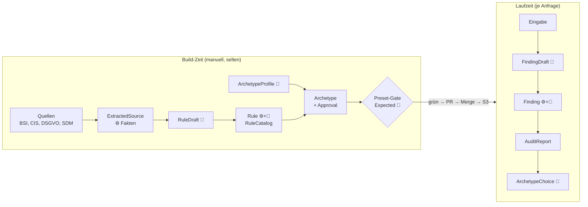

# GovGuard – Das Datenmodell erklärt

> **Lern-Handbuch.** Dieses Dokument ist bewusst länger als die übrige Doku (ca. 10 Minuten Lesezeit). Es erklärt das *Warum* hinter den Verträgen. Verbindlich bleiben [DESIGN.md](DESIGN.md) (Felder und Signaturen), [ARCHITECTURE.md](ARCHITECTURE.md) (Big Picture) und [CONTEXT.md](../CONTEXT.md) (Begriffe).

**Zielgruppe:** Junior-Entwickler, System-Architekten, IHK-Prüfer.

---

## 0. Das Paradigma in einem Satz

> **Das LLM liefert Entwürfe. Der Code entscheidet, ob daraus Fakten werden.**

Ein Sprachmodell ist gut im Verstehen, Bewerten und Formulieren. Es ist aber **probabilistisch**: Dieselbe Frage kann verschiedene Antworten ergeben, und eine plausibel klingende Antwort kann erfunden sein (**Halluzination**). Für ein Compliance-Werkzeug ist das gefährlich, denn ein erfundener Normverweis in einem Audit-Report ist schlimmer als gar keiner.

GovGuard behandelt deshalb jede LLM-Ausgabe als **unvertrauenswürdige Eingabe**, genau wie ein Formular aus dem Internet. Daraus folgen zwei Prinzipien, die sich durch das ganze Datenmodell ziehen.

### 0.1 Design by Contract

**Design by Contract** (Vertragsprinzip nach Bertrand Meyer) heißt: Jede Schnittstelle legt fest, was sie verlangt und was sie garantiert. In GovGuard sind diese Verträge Pydantic-Modelle und Funktionssignaturen.

| Vertragsteil | Bedeutung | Beispiel in GovGuard |
|---|---|---|
| **Vorbedingung** | Was muss beim Aufruf gelten? | Eingabe höchstens 100.000 Zeichen, sonst HTTP 400 |
| **Nachbedingung** | Was garantiert das Ergebnis? | Genau ein Befund je Prüfregel, jeder Beleg wörtlich in der Eingabe |
| **Invariante** | Was gilt immer? | Gesamtstatus = schlechtester Einzelstatus; Archetypen passen zum Hash des Regelkatalogs |

Der Clou: Das LLM kann diese Verträge nicht garantieren. **Der Code prüft sie**, und zwar jedes Mal.

### 0.2 Das Draft-Pattern

Fast jedes Kernmodell gibt es in GovGuard doppelt:

```
RuleDraft      ──(Code prüft + ergänzt)──▶  Rule
FindingDraft   ──(Code prüft + ergänzt)──▶  Finding
ArchetypeProfile ─(Build erzeugt + gibt frei)─▶ Archetype
```

- Der **Draft** (Entwurf) enthält *nur* die Felder, die Sprachverständnis brauchen. Aus genau dieser Klasse erzeugt Pydantic das JSON-Schema des Tools, das das LLM ausfüllen muss. Der Draft ist also gleichzeitig **Datenklasse und Formular**.
- Die **Entity** (das fertige Objekt) erbt vom Draft (`class Rule(RuleDraft)`) und ergänzt Felder, die der Code sicher weiß: IDs, Anker, Herkunft, Rang.

> **Begriffsklärung „Entity“:** Im Domain-Driven Design ist eine Entity ein Objekt mit eigener Identität über die Zeit. Hier meint „Entity“ schlicht das **fertige, geprüfte und angereicherte Objekt** im Gegensatz zum rohen Entwurf. Ein `Finding` ist streng genommen ein angereichertes Wertobjekt. Im Fachgespräch passt dafür der Begriff **DTO-zu-Domänenobjekt-Anreicherung**.

Die Leitregel aus ARCHITECTURE.md dahinter: **Was der Code schon weiß, erzeugt das LLM nicht.** Jedes Feld, das das LLM nicht ausfüllen muss, kann es auch nicht falsch ausfüllen.

### 0.3 Legende für dieses Handbuch

Jedes Feld bekommt eine Herkunftsmarke:

| Marke | Wer füllt es? | Vertrauen |
|---|---|---|
| 🤖 | LLM | gering, wird vom Code geprüft |
| ⚙️ | Code (deterministisch) | hoch, reproduzierbar |
| 👤 | Mensch (von Hand gepflegt) | hoch, fachlich verantwortet |

---

## 1. Der Lebenszyklus im Überblick



Die Reise der Daten hat fünf Stationen. Die Kapitel folgen genau dieser Reihenfolge.

---

## 2. Station 1 – Rohdaten: `Requirement` und `ExtractedSource`

**Aufgabe:** Die Quellen (PDF, OSCAL-JSON) werden in ein einheitliches Format gebracht. Hier ist **kein LLM** beteiligt.

| Feld | Wer | Warum existiert es? |
|---|---|---|
| `id` | ⚙️ | ID exakt wie in der Quelle (`"3.1.4"`, `"Art. 32"`), damit ein Mensch sie wiederfindet |
| `title`, `text` | ⚙️ | Volltext, mit `normalize()` bereinigt. Gegen diesen Text werden später Zitate geprüft |
| `primary_anchor` | ⚙️ | Zitierfähige Fundstelle im festen Format (`"CIS AWS v7.0.0 3.1.4"`) |
| `attributes` | ⚙️ | Reine Fakten der Quelle (Kapitel, Level, Schutzziel-Summe) für Vorfilter und Ranking |
| `prefilter_passed` | ⚙️ | Ergebnis von `prefilter()`, deterministisch und reproduzierbar |
| `ExtractedSource.version` | ⚙️ | Welche Fassung der Norm? Bei BSI ein Commit-SHA |

**Warum enthält die Datei *alle* Anforderungen, nicht nur die gefilterten?**
Weil das Gate später auch **Querverweise** prüft. Diese können auf Anforderungen zeigen, die nicht im Katalog gelandet sind. Ohne die vollständige Liste könnte der Code nicht entscheiden, ob „BSI DET.3.99“ existiert oder erfunden ist.

**Warum sind `attributes` nur Fakten?**
Trennung von Extraktion und Bewertung: Der Adapter liest nur, gefiltert und gerankt wird erst in `prefilter()` und `ranking.py`. So bleibt jede Stufe einzeln testbar.

> **Risiko mitigiert:** Die Quelle ist die einzige Wahrheit. Alles, was später ein LLM behauptet, wird gegen diese Datei geprüft. Station 1 ist das **Fundament der Beweisführung**.

---

## 3. Station 2 – Die Prüfregel-Fabrik: `RuleDraft` → `Rule`

**Aufgabe:** Aus jeder ausgewählten Anforderung entsteht genau eine prüfbare **Prüfregel**. Vorher hat Stufe ② (Tool `classify_requirement`) entschieden, ob die Anforderung überhaupt prüfbar ist, und Stufe ③ hat deterministisch gerankt.

### 3.1 Was das LLM liefert: `RuleDraft` (Tool `formulate_rule`)

| Feld | Wer | Warum existiert es? |
|---|---|---|
| `source_quote` | 🤖 → ⚙️ geprüft | Wörtlicher Auszug aus der Norm. Er beweist, dass die Regel nicht ausgedacht ist |
| `title`, `compliant_if`, `violation_if` | 🤖 | Übersetzt Normsprache in prüfbare Kriterien: Wann PASS, wann FAIL? |
| `recommendation` | 🤖 | Konkrete Abhilfe für den Nutzer |
| `cfn_resource_types` | 🤖 | Für welche CloudFormation-Typen gilt die Regel? Nur bei Architektur (siehe 4.3) |
| `cross_references` | 🤖 → ⚙️ geprüft | Bezug auf eine andere Quelle, immer `origin: "ai_suggested"` |

### 3.2 Was der Code ergänzt: `Rule`

| Feld | Wer | Warum existiert es? |
|---|---|---|
| `id` | ⚙️ | Abgeleitet: `ARCH-CIS-3.1.4`. Stabil und eindeutig, das LLM kann keine Kollision erzeugen |
| `audit_type`, `source` | ⚙️ | Aus dem Kontext des Build-Laufs bekannt |
| `primary_anchor` | ⚙️ | Aus dem `Requirement` übernommen, **nie** vom LLM |
| `selection_rationale` | 🤖 aus Stufe ②, ⚙️ übernommen | Nachvollziehbarkeit: Warum ist diese Regel im Katalog? |
| `rank` | ⚙️ | Ergebnis des deterministischen Rankings |

### 3.3 Das Gate: Vom Entwurf zur Prüfregel

Bevor eine Regel in den Katalog darf, prüft der Code drei Punkte:

1. **Schema:** Passt das JSON zum Modell?
2. **Anker:** Gibt es den Primäranker und jeden Querverweis wirklich in `data/extracted/`?
3. **Zitat:** Steht `source_quote` per `contains_quote()` wörtlich im `text` **genau der verankerten Anforderung**, nicht irgendwo in der Quelle?

Der dritte Punkt ist subtil: Ein Zitat aus Art. 5 darf eine Regel zu Art. 32 nicht „belegen“. Darum prüft das Gate nur gegen die eine Anforderung.

**Warum ist `cross_references.origin` ein `Literal` mit nur einem Wert?**
Das Feld ist ein **ehrliches Etikett**. Querverweise sind KI-Vorschläge, nicht verifizierte Mappings. Der Code prüft nur, dass das Ziel existiert, nicht, ob der Bezug inhaltlich stimmt. Darum beeinflussen Querverweise **keinen Status**. Das Feld macht diese Unsicherheit im Datenmodell sichtbar, statt sie zu verstecken.

### 3.4 Der Container: `RuleCatalog`

| Feld | Wer | Warum existiert es? |
|---|---|---|
| `source_versions` | ⚙️ | Gegen welche Normfassung wurde gebaut? Pflicht für jede Audit-Aussage |
| `model_id` | ⚙️ | Welches Modell hat formuliert? Nachvollziehbarkeit (KI-Governance) |
| `rules` | ⚙️ + 🤖 | Der Bounded Catalog: fest begrenzt, in jedem Audit vollständig bewertet |

**Warum fehlt ein Zeitstempel?** Ein unveränderter Build soll **keinen Git-Diff** erzeugen. So sieht der Reviewer im Pull Request nur echte inhaltliche Änderungen.

> **Risiken mitigiert:** erfundene Fundstellen (Anker-Check), erfundener Normtext (Zitat-Check), Scheinpräzision bei Mappings (`ai_suggested`).

---

## 4. Station 3 – Architektur-Schablonen: `ArchetypeProfile` → `Archetype`

**Aufgabe:** Drei **Golden Archetypes** entstehen zur Build-Zeit als CDK-Code und werden vorab freigegeben. Zur Laufzeit wird nichts mehr generiert, nur ausgewählt.

### 4.1 Die menschliche Vorgabe: `ArchetypeProfile` 👤

| Feld | Warum existiert es? |
|---|---|
| `id` (`Literal["ARCH-01", …]`) | Geschlossene Menge, das LLM kann keinen vierten Archetyp erfinden |
| `purpose` | Zweck auf Deutsch. Nutzt später auch `select_archetype()` zur Auswahl |
| `constructs` | Welche AWS Solutions Constructs sind vorgegeben? |
| `required_resource_types` | **Struktur-Soll:** Diese CloudFormation-Typen müssen im Template stehen |

Der Steckbrief ist die **einzige feste Vorgabe** an das LLM. Ohne `required_resource_types` könnte das LLM eine „sichere“ Architektur liefern, die einfach die Datenbank weglässt.

### 4.2 Das Ergebnis: `Archetype` mit `Approval`

| Feld | Wer | Warum existiert es? |
|---|---|---|
| `cdk_code` | 🤖 | Python-CDK, eine Datei |
| `template` | ⚙️ | Ausgabe von `cdk synth`. Geprüft wird das Template, nicht der Code, weil Solutions Constructs ihre Sicherheits-Defaults im Code verbergen (ADR 0003) |
| `approval.audit_report` | ⚙️ + 🤖 | Das eigene Architektur-Audit: nur PASS oder N/A erlaubt |
| `approval.cdk_nag_errors` | ⚙️ | Unabhängige deterministische Zweitprüfung, muss leer sein |
| `approval.rounds` | ⚙️ | Wie viele Korrekturrunden waren nötig (1–3)? |

**Warum `rounds` mit Obergrenze 3?**
Die Freigabe-Schleife lautet: LLM schreibt → `synth` → Audit → Beanstandung → LLM korrigiert. Ohne Obergrenze droht eine **Endlosschleife**, die Geld kostet und nie konvergiert. Nach drei Runden bricht der Build ab, und die alte Wissensbasis bleibt aktiv. Das Feld dokumentiert zusätzlich, wie schwer sich das LLM getan hat.

**Warum zwei Prüfer (Audit-Engine *und* cdk-nag)?**
Die Audit-Engine nutzt ein LLM. Würde sie allein freigeben, prüfte ein LLM das Werk eines LLM. cdk-nag ist rein regelbasiert und unabhängig: **Vier-Augen-Prinzip für Infrastructure as Code**. `NagSuppressions` im Archetyp-Code sind verboten, sonst könnte das LLM die Prüfung einfach abschalten.

### 4.3 Wie `cfn_resource_types` das Wegdefinieren verhindert

Ein LLM, das eine Regel nicht erfüllen kann, hat einen bequemen Ausweg: „N/A, nicht anwendbar“. Dagegen hilft das Feld `cfn_resource_types` aus der Prüfregel. Der Code verbietet N/A, sobald einer dieser Typen im Template vorkommt. Enthält das Template einen `AWS::S3::Bucket`, muss die S3-Regel PASS sein.

### 4.4 Die Klammer: `ArchetypeCatalog.rules_arch_sha256`

Archetypen sind nur gegen **einen bestimmten** Regelkatalog freigegeben. Ändert sich `rules_arch.json`, ist die Freigabe wertlos. Der Hash macht diese Abhängigkeit maschinell prüfbar: Passt er nicht zur Datei daneben, schlägt das Preset-Gate fehl.

> **Risiken mitigiert:** Endlosschleife (`rounds`), LLM prüft LLM (cdk-nag), Wegdefinieren unbequemer Regeln (`cfn_resource_types`), veraltete Freigabe (`rules_arch_sha256`).

---

## 5. Station 4 – Das Laufzeit-Audit: `FindingDraft` → `Finding` → `AuditReport`

**Aufgabe:** Eine Spezifikation oder Architektur wird gegen den Bounded Catalog geprüft. Hier zeigt sich das Draft-Pattern am deutlichsten.

### 5.1 Was das LLM liefert: `FindingDraft` (im Tool `submit_audit`)

| Feld | Wer | Warum existiert es? |
|---|---|---|
| `rule_id` | 🤖 → ⚙️ geprüft | Ordnet den Befund einer Prüfregel zu. Muss im Katalog existieren |
| `status` | 🤖 | `Literal["PASS", "WARN", "FAIL", "N/A"]`, ein „OK“ ist unmöglich |
| `evidence` | 🤖 → ⚙️ geprüft | **Beleg:** wörtliches Zitat aus der Eingabe. Pflicht bei PASS und FAIL |
| `rationale` | 🤖 | Begründung in eigenen Worten |
| `recommendation` | 🤖 | Abhilfe. Pflicht bei WARN und FAIL |

**Warum ist der Beleg genau bei PASS und FAIL Pflicht?**
Das folgt aus dem Glossar. PASS heißt „Einhaltung *belegt*“, FAIL heißt „Verstoß *belegt*“. Beides braucht ein Zitat. Fehlt eine Information in der Eingabe, ist das WARN („nicht entscheidbar“), nicht FAIL. Diese Unterscheidung verhindert, dass das LLM aus **Abwesenheit** einen Verstoß konstruiert.

### 5.2 Was der Code ergänzt: `Finding` und `AuditReport`

| Feld | Wer | Warum existiert es? |
|---|---|---|
| `Finding.title`, `primary_anchor`, `cross_references` | ⚙️ aus dem Katalog | Das LLM muss sie nicht wiederholen und kann sie daher nicht verfälschen |
| `AuditReport.overall_status` | ⚙️ | Schlechtester Status gewinnt (FAIL > WARN > PASS > N/A). Reines Rechnen, kein Urteil |
| `AuditReport.findings` | ⚙️ sortiert | Genau einer je Prüfregel, Reihenfolge wie im Katalog |
| `AuditReport.model_id` | ⚙️ | Welches Modell hat geurteilt? |

**Warum berechnet nicht das LLM den Gesamtstatus?** Weil es dafür genau eine richtige Antwort gibt, die sich ohne Sprachverständnis ermitteln lässt. Das ist die Testfrage aus ARCHITECTURE.md: Eindeutig und ohne Sprache lösbar → Code.

### 5.3 Die Validierungskette in `run_audit()`

```
LLM-Antwort (roher dict)
  │
  ├─ 1. Pydantic: passt das Schema AuditResponse?
  ├─ 2. Vollständigkeit: jede rule_id genau einmal, keine unbekannten IDs?
  ├─ 3. Beleg: vorhanden, wo Pflicht, und contains_quote(input, evidence)?
  │
  ├─ alles ok ──────────▶ anreichern → AuditReport
  └─ Fehler ──▶ EIN zweiter Aufruf, Fehlermeldung im Prompt
                  ├─ ok ──▶ AuditReport
                  └─ Fehler ──▶ AuditValidationError → HTTP 502
```

- **Schritt 2** schützt die Kernaussage des Bounded Catalog (ADR 0002): Keine Prüfregel kann still verloren gehen, und keine erfundene Regel kann sich einschleichen.
- **Schritt 3** ist der Halluzinationsschutz: Ein Beleg, der nicht wörtlich in der Eingabe steht, ist eine Behauptung, kein Beweis.
- **Genau ein Retry** ist ein bewusster Kompromiss: Viele Fehler behebt das LLM, wenn es die Fehlermeldung sieht. Mehr Runden würden das 29-Sekunden-Limit von API Gateway sprengen. Danach gilt **Fail closed**: lieber ein ehrlicher Fehler (502) als ein ungeprüfter Report.

### 5.4 Die Naht zum LLM: `LlmCall`

```python
class LlmCall(Protocol):
    def __call__(self, *, system: str, user: str, tool: str,
                 schema: type[BaseModel]) -> dict: ...
```

Die Prüflogik kennt Bedrock nicht. Sie bekommt eine Funktion übergeben (**Dependency Injection**). Der Rückgabetyp ist bewusst `dict`, nicht das Pydantic-Modell: Das Protokoll verspricht nur **rohe, unvalidierte Daten**. Die Validierung gehört der Prüflogik, nicht dem Adapter. In Tests ersetzt ein Fake mit festen Antworten das LLM. So lassen sich auch kaputte Antworten gezielt simulieren.

### 5.5 Die Auswahl: `ArchetypeChoice`

| Feld | Wer | Warum existiert es? |
|---|---|---|
| `archetype` | 🤖 | `Literal["ARCH-01", "ARCH-02", "ARCH-03", "NONE"]` |
| `rationale` | 🤖 | Begründung der Wahl |

`NONE` ist eine **erlaubte Antwort**. Ohne sie wäre das LLM gezwungen, auch bei unpassender Spezifikation einen Archetyp zu wählen. CDK-Code und Template lädt danach der Code aus `archetypes.json`, das LLM liefert nur die ID. Enthält der Report ein FAIL, wirft `select_archetype()` einen `ValueError` (HTTP 422): Für eine nicht konforme Spezifikation gibt es keine Architektur-Empfehlung.

> **Risiken mitigiert:** erfundene Belege (Schritt 3), vergessene Prüfregeln (Schritt 2), erfundene Status- oder Archetyp-Werte (`Literal`), Timeout durch Retry-Kaskaden (genau ein Retry).

---

## 6. Station 5 – Qualitätssicherung: `Preset` und `Expected`

**Aufgabe:** Bevor eine neue Wissensbasis live geht, muss sie vier bekannte Beispiele richtig bewerten. Das ist das **Preset-Gate**.

| Feld | Wer | Warum existiert es? |
|---|---|---|
| `Preset.input_file` | 👤 | Fiktive Eingabe, höchstens 100.000 Zeichen |
| `Expected.overall_status` | 👤 | Soll-Gesamtstatus |
| `Expected.required_findings` | 👤 | Pflicht-Befunde: `anchor` + `status` |
| `Expected.archetype` | 👤 | Soll-Archetyp, nur bei Spec ohne FAIL |

**Warum legt ein Mensch das Soll fest?**
Würde man das Soll aus einem früheren Lauf übernehmen, prüfte das System nur, ob es sich selbst wiederholt. Das ist ein **zirkulärer Test**: Er wird grün, auch wenn beide Läufe falsch sind. Nur ein unabhängig gesetztes Soll macht das Gate zu einem echten **Testorakel** (unabhängige Quelle der richtigen Antwort).

**Warum `anchor` statt `rule_id`?**
Ein Mensch kennt „DSGVO Art. 9“ direkt aus der Norm, nicht aus unserem Katalog. Der Anker ist außerdem die fachliche Bezugsgröße, unabhängig davon, wie der Build die Regel benennt.

**Warum sind weitere Befunde „frei“?**
Das LLM formuliert bei jedem Build leicht andere Texte und urteilt bei Grenzfällen nicht immer gleich. Ein Test, der jeden der 20–24 Befunde festnagelt, wäre **brüchig** (er schlägt bei harmlosen Änderungen fehl). Das Gate prüft deshalb nur, was fachlich zwingend ist.

> **Risiken mitigiert:** zirkuläre Tests (menschliches Soll), brüchige Tests (nur Pflicht-Befunde), stille Verschlechterung der Wissensbasis (Gate vor dem Pull Request).

---

## 7. Der gemeinsame Kitt: `normalize()` und `contains_quote()`

Zwei kleine Funktionen tragen den ganzen Halluzinationsschutz: der Zitat-Check im Build (`source_quote` gegen den Normtext) und der Beleg-Check zur Laufzeit (`evidence` gegen die Eingabe).

**Warum dieselbe Funktion für beide?**
Normalisierten Build und Laufzeit unterschiedlich, könnte ein Zitat im Build bestehen und zur Laufzeit scheitern oder umgekehrt. Eine Funktion ist **eine Wahrheit**.

| Entscheidung | Warum |
|---|---|
| Leerzeichen, Anführungszeichen, EUR-Lex-Marker vereinheitlichen | PDF-Extraktion erzeugt technische Unterschiede, die keine inhaltlichen sind |
| Groß- und Kleinschreibung bleibt | „Wörtlich“ heißt wörtlich |
| `MIN_QUOTE_LENGTH = 15` | Ein Zitat wie „S3“ steht fast überall und beweist nichts |
| Silbentrennung wird nicht repariert | „Verarbei- tung“ ist von „Cloud-Dienst“ nicht sicher unterscheidbar. Lieber eine bekannte Grenze als ein falscher Treffer |

---

## 8. Zusammenfassung: Risiko-Matrix

| Risiko | Vertrag / Feld | Wer prüft |
|---|---|---|
| Halluzinierter Normtext | `RuleDraft.source_quote` + `contains_quote()` | ⚙️ Build-Gate |
| Erfundene Fundstelle | `Rule.primary_anchor` (vom Code gesetzt), Anker-Check für `cross_references` | ⚙️ Build-Gate |
| Halluzinierter Beleg im Audit | `FindingDraft.evidence` + `contains_quote()` | ⚙️ `run_audit()` |
| Vergessene oder erfundene Prüfregel | genau ein Befund je `rule_id` | ⚙️ `run_audit()` |
| Erfundene Statuswerte oder Archetypen | `Literal`-Typen im Tool-Schema | ⚙️ Pydantic |
| Verstoß aus fehlender Information | Beleg-Pflicht bei FAIL; Lücke = WARN | ⚙️ `run_audit()` |
| Unbequeme Regel wegdefiniert | `cfn_resource_types` sperrt N/A | ⚙️ Freigabe |
| LLM prüft LLM | `Approval.cdk_nag_errors` | ⚙️ cdk-nag |
| Endlosschleife / Kosten | `Approval.rounds` ≤ 3; genau ein Retry zur Laufzeit | ⚙️ Build / `run_audit()` |
| Veraltete Freigabe | `ArchetypeCatalog.rules_arch_sha256` | ⚙️ Preset-Gate |
| Zirkulärer Test | `Expected` von Hand, Bezug über `anchor` | 👤 + ⚙️ Preset-Gate |
| Scheinpräzision bei Mappings | `CrossReference.origin = "ai_suggested"`, ohne Einfluss auf den Status | ⚙️ by design |

**Fachgespräch-Satz:**
„Bei GovGuard ist das LLM nur Lieferant von Entwürfen. Jede Aussage, die im Report landet, hat entweder der Code selbst erzeugt oder der Code gegen ein wörtliches Zitat geprüft. Das ist Design by Contract mit dem LLM als unvertrauenswürdigem Vertragspartner.“
