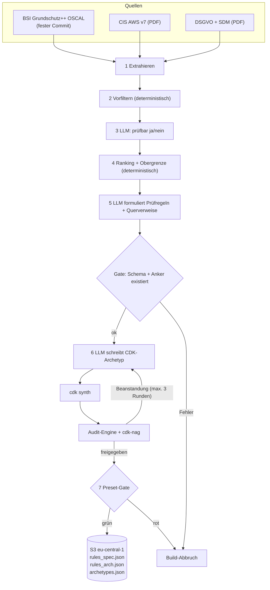
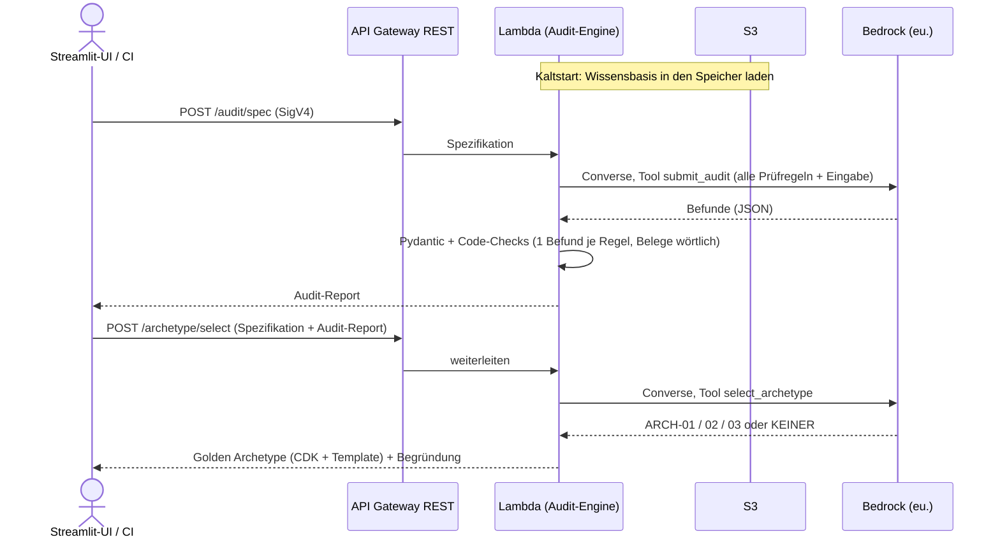
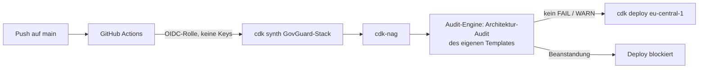

# GovGuard – Big Picture

GovGuard hat zwei Betriebsarten: **Build-Zeit** (Wissensbasis und Golden Archetypes erzeugen) und **Laufzeit** (Audits beantworten). Beide nutzen dieselbe **Audit-Engine**. Begriffe: [CONTEXT.md](../CONTEXT.md), Anforderungen: [SPEC.md](SPEC.md).

## 1. Build-Zeit – Wissensbasis erzeugen (lokal oder per manuellem Workflow)

Das Build-Skript liest die Quellen ein und siebt sie in zwei Stufen: Ein deterministischer Vorfilter wirft offensichtlich Irrelevantes weg, dann entscheidet das LLM je Anforderung, ob sie an einer Spezifikation oder an Infrastructure as Code (IaC) prüfbar ist. Ein festes Ranking schneidet auf die Obergrenze des Bounded Catalog ab; erst danach formuliert das LLM daraus Prüfregeln.

Für jede Prüfregel prüft der Code, ob das Schema stimmt und ob der Primäranker in der Quelle wirklich existiert. Danach entstehen die Golden Archetypes. Das LLM schreibt CDK-Code, `cdk synth` macht daraus ein CloudFormation-Template, und unsere Audit-Engine sowie cdk-nag prüfen dieses Template. Bei Beanstandungen korrigiert das LLM, höchstens dreimal.

Zum Schluss müssen die 4 Presets ihr festgelegtes Soll-Ergebnis liefern. Nur wenn alle Gates grün sind, landet die neue Wissensbasis in S3. Jeder Fehler bricht den Build ab, und die alte Version bleibt aktiv.

## 2. Laufzeit – ein Audit

Beim Kaltstart lädt die Lambda-Funktion die Wissensbasis einmal aus S3 in den Speicher, weitere Aufrufe nutzen sie direkt. Für ein Audit schickt sie **alle** Prüfregeln des Bounded Catalog zusammen mit der Eingabe an Bedrock. Das Modell muss über das erzwungene Tool `submit_audit` antworten (Tool-Choice), es kann also nur strukturiertes JSON liefern, keinen Freitext.

Danach prüft der Code, nicht das Modell, das Ergebnis. Pydantic validiert das Schema, und zusätzlich muss jede Prüfregel genau einen Befund haben und jeder Beleg wörtlich in der Eingabe stehen. Erst dann wird der Gesamtstatus berechnet.

Hat das Spec-Audit kein FAIL, kann der Client in einem zweiten Aufruf einen Golden Archetype anfordern. Das Modell wählt dann nur aus einer geschlossenen Liste: ARCH-01, -02, -03 oder „keiner“. Das Architektur-Audit (`POST /audit/architecture`) läuft genauso wie das Spec-Audit ab, nur mit den Prüfregeln aus BSI und CIS.

## 3. Deployment – GovGuard prüft sich selbst

GovGuard wird selbst mit CDK beschrieben und über GitHub Actions ausgerollt. Die Pipeline meldet sich per OIDC bei AWS an und erhält kurzlebige Rechte, es liegen also keine dauerhaften Zugangsschlüssel in GitHub.

Vor jedem Deploy durchläuft der eigene Stack dieselben zwei Prüfungen wie die Golden Archetypes. Erst prüft cdk-nag deterministisch, dann prüft die Audit-Engine das Template gegen die BSI- und CIS-Prüfregeln. Ein FAIL oder WARN blockiert das Deployment.

So beweist GovGuard an sich selbst, dass seine Regeln erfüllbar sind (Dogfooding).

## Komponenten

| Komponente | Aufgabe | Technik |
|---|---|---|
| Build-Skript | Wissensbasis und Archetypen erzeugen | Python, boto3, CDK CLI |
| Audit-Engine | Prompt bauen, Bedrock aufrufen, Befunde validieren | Python-Modul, Pydantic |
| API | 3 Endpunkte, IAM-Auth, Throttling | API Gateway REST + Lambda |
| Wissensbasis | Prüfregeln und Golden Archetypes | JSON in S3, versioniert |
| UI | Eingabe, Ampel, Download | Streamlit Community Cloud (ADR 0004) |
| Pipeline | Selbst-Audit und Deploy | GitHub Actions, CDK |

## Endpunkte

| Endpunkt | Eingabe → Ausgabe |
|---|---|
| `POST /audit/spec` | Spezifikation → Audit-Report |
| `POST /audit/architecture` | Architektur → Audit-Report |
| `POST /archetype/select` | Spezifikation + Spec-Audit-Report → Golden Archetype oder „keiner“; abgelehnt bei FAIL |

- Getrennte Endpunkte halten jeden Aufruf bei **einem** Bedrock-Call (29-s-Timeout).
- `/archetype/select` vertraut dem mitgesendeten Report: vertretbar, weil Archetypen öffentlich und vorab freigegeben sind.
- Scheitert die Validierung, folgt ein erneuter Bedrock-Aufruf mit der Fehlermeldung, danach HTTP 502.

## Offene Fragen

- KMS-CMK für den eigenen Stack kostet ca. 1 $/Monat je Schlüssel – Widerspruch zu „0 € im Leerlauf“ oder akzeptierter Preis für Compliance?
