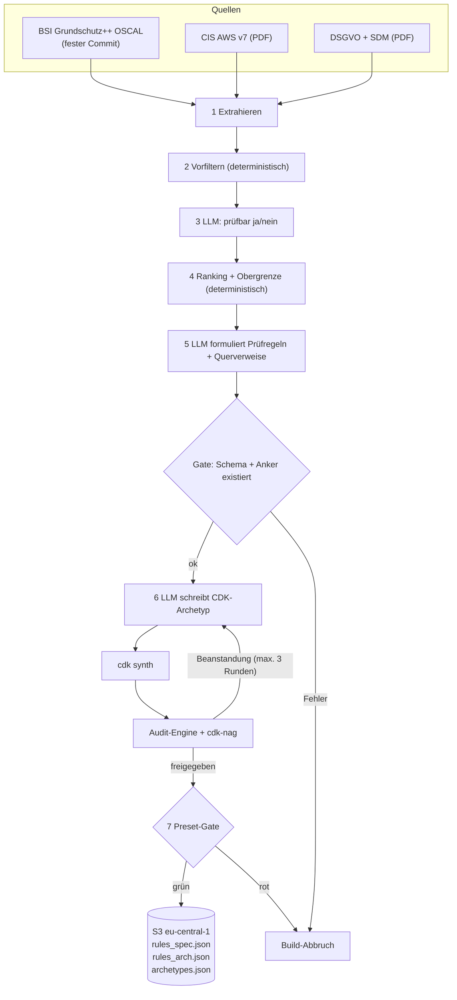
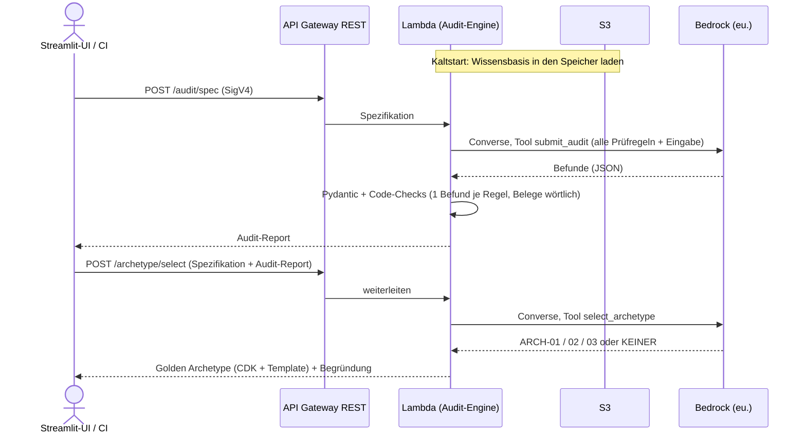
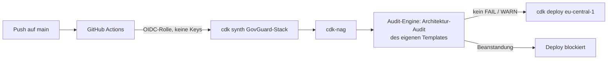

# GovGuard – Big Picture

GovGuard hat zwei Betriebsarten: **Build-Zeit** (Wissensbasis und Golden Archetypes erzeugen) und **Laufzeit** (Audits beantworten). Beide nutzen dieselbe **Audit-Engine**. Begriffe: [CONTEXT.md](../CONTEXT.md), Anforderungen: [SPEC.md](SPEC.md).

## 1. Build-Zeit – Wissensbasis erzeugen (lokal oder per manuellem Workflow)



Das Build-Skript liest die Quellen ein und siebt sie in zwei Stufen: Ein deterministischer Vorfilter wirft offensichtlich Irrelevantes weg, dann entscheidet das LLM je Anforderung, ob sie an einer Spezifikation oder an Infrastructure as Code (IaC) prüfbar ist. Ein festes Ranking schneidet auf die Obergrenze des Bounded Catalog ab; erst danach formuliert das LLM daraus Prüfregeln.

Für jede Prüfregel prüft der Code, ob das Schema stimmt und ob der Primäranker in der Quelle wirklich existiert. Danach entstehen die Golden Archetypes. Das LLM schreibt CDK-Code, `cdk synth` macht daraus ein CloudFormation-Template, und unsere Audit-Engine sowie cdk-nag prüfen dieses Template. Bei Beanstandungen korrigiert das LLM, höchstens dreimal.

Zum Schluss müssen die 4 Presets ihr festgelegtes Soll-Ergebnis liefern. Nur wenn alle Gates grün sind, landet die neue Wissensbasis in S3. Jeder Fehler bricht den Build ab, und die alte Version bleibt aktiv.

### 1.1 Sieben: Vorfilter, LLM, Ranking

Jede Quelle durchläuft dieselben drei Stufen; nur die Parameter unterscheiden sich. Leitsatz: **Das LLM urteilt, der Code wählt aus.**

| Quelle | Einheit (Anforderung) | ① Vorfilter (Code) | ② LLM-Frage (ja/nein + Begründung) | ③ Ranking (Code) | Obergrenze |
|---|---|---|---|---|---|
| BSI Grundschutz++ | Control im OSCAL-Katalog, z. B. `DET.3.1` | `modal_verb` = MUSS, `sec_level` = normal-SdT, Praktik ∈ DLS, BER, DET, KONF, BES, ARCH | „An einer Architektur / IaC prüfbar?“ | Summe `confidentiality` + `integrity` + `availability` (0–6) absteigend | 12 |
| CIS AWS v7 | Empfehlung, z. B. `3.1.4` | Kapitel 2 IAM, 3 Storage, 4 Logging | „An einer Architektur / IaC prüfbar?“ | Level 1 vor Level 2, dann *Automated* vor *Manual* | 12 |
| DSGVO | Artikel | Kapitel II–V (Art. 5–49) | „An einer Spezifikation prüfbar?“ | Bußgeldstufe: Art. 83 Abs. 5 (bis 4 %) vor Abs. 4 (bis 2 %) | 12 |
| SDM | Maßnahme, z. B. `M60.D01` | Bausteine Löschen (M60), Trennen (M50), Zugriffe regeln (M51), Protokollieren (M43); Ebenen Daten (D) und Systeme (S), nicht Prozesse (P) | „An einer Spezifikation prüfbar?“ | reihum je Baustein, D vor S | 8 |

- **① Vorfilter:** reiner Code auf Metadaten (OSCAL-Props, Kapitelnummern, Artikelnummern, Maßnahmen-IDs). Er ist billig, reproduzierbar und wirft Organisatorisches früh weg.
- **② LLM:** bekommt **eine** Anforderung und antwortet nur ja/nein mit Begründung (per Tool-Choice, siehe 2.1). Es zählt nicht und wählt nicht aus.
- **③ Ranking:** sortiert die „Ja“-Anforderungen nach dem Kriterium der Tabelle, bei Gleichstand nach ID aufsteigend, und schneidet bei der Obergrenze ab. Gleiche Eingabe ergibt dieselbe Reihenfolge. Die Auswahlliste liegt versioniert im Repo; Änderungen zwischen zwei Builds sieht man im Git-Diff.

### 1.2 Prüfregel-Schema

Aus jeder ausgewählten Anforderung formuliert das LLM genau eine Prüfregel (Pydantic-Modell `Pruefregel`). Beispiel:

```json
{
  "id": "ARCH-CIS-3.1.4",
  "audit_art": "architektur",
  "quelle": "CIS",
  "primaeranker": "CIS AWS v7.0.0 3.1.4",
  "quelltext_zitat": "Ensure that S3 is configured with 'Block Public Access' enabled",
  "titel": "S3 Block Public Access aktiv",
  "konform_wenn": "Jeder S3-Bucket hat alle vier Block-Public-Access-Einstellungen aktiv.",
  "verstoss_wenn": "Ein Bucket deaktiviert mindestens eine Einstellung.",
  "empfehlung": "Am Bucket BlockPublicAccess.BLOCK_ALL setzen.",
  "cfn_ressourcentypen": ["AWS::S3::Bucket"],
  "auswahl_begruendung": "Direkt an der Bucket-Konfiguration im Template prüfbar.",
  "rang": 3,
  "querverweise": [{ "anker": "BSI GS++ …", "herkunft": "KI-vorgeschlagen" }]
}
```

| Feld | Herkunft | Zweck |
|---|---|---|
| `id`, `audit_art`, `quelle`, `primaeranker`, `rang` | Code | Identität und Herkunft – das LLM erfindet hier nichts |
| `quelltext_zitat` | LLM, vom Code geprüft | Wörtlicher Auszug aus der Quelle (siehe 1.3) |
| `titel`, `konform_wenn`, `verstoss_wenn`, `empfehlung` | LLM | Prüfbare Kriterien für PASS/FAIL und die Abhilfe |
| `cfn_ressourcentypen` | LLM, nur Architektur | Für welche CloudFormation-Typen die Regel gilt (sperrt N/A, siehe 1.4) |
| `auswahl_begruendung` | LLM aus Stufe ② | Warum die Anforderung prüfbar ist |
| `querverweise` | LLM, vom Code geprüft | Bezug auf eine andere Quelle; nur „KI-vorgeschlagen“, ohne Einfluss auf den Status |

### 1.3 Primäranker

Der Primäranker ist die **eine** Anforderung, aus der eine Prüfregel stammt. Ihn setzt der Code, nicht das LLM, denn er kennt die ID aus Stufe ①. Das Gate prüft zwei Dinge:

| Quelle | Format | Existenz-Check |
|---|---|---|
| BSI | `BSI GS++ DET.3.1` + Commit-SHA des Katalogs | ID existiert im Katalog-JSON |
| CIS | `CIS AWS v7.0.0 3.1.4` | Nummer und Titel stehen im PDF-Text |
| DSGVO | `DSGVO Art. 32` (optional Abs./lit.) | Überschrift „Artikel 32“ steht im PDF-Text |
| SDM | `SDM Löschen M60.D01` | Maßnahmen-ID steht im Baustein-Text |

Zusätzlich muss das `quelltext_zitat` **wörtlich** im extrahierten Quelltext stehen, nach Normalisierung von Leerzeichen und Zeilenumbrüchen und nach Entfernen von EUR-Lex-Markern wie „►C2“. Das ist dasselbe Prinzip wie der Beleg zur Laufzeit: Zitat statt Behauptung.

### 1.4 Soll-Ergebnis der Golden Archetypes

Für Presets legt ein Mensch das Soll fest. Für Archetypen ist es **vollautomatisch** und besteht aus drei Bedingungen, die alle erfüllt sein müssen:

1. **Struktur-Soll:** Das Template enthält die Pflicht-Ressourcentypen aus dem Steckbrief des Archetyps (deterministischer Check).
2. **Compliance-Soll:** Jede Architektur-Prüfregel ist PASS oder N/A. N/A ist **verboten**, wenn einer ihrer `cfn_ressourcentypen` im Template vorkommt (Code-Check). So kann das LLM eine unbequeme Regel nicht wegdefinieren.
3. **cdk-nag:** Das Regelpaket AwsSolutions meldet keine Errors. `NagSuppressions` sind im Archetyp-Code verboten (Code-Check).

| Archetyp | Solutions Constructs | Pflicht-Ressourcentypen |
|---|---|---|
| ARCH-01 Sync REST | `aws-apigateway-lambda`, `aws-lambda-dynamodb` | `AWS::ApiGateway::RestApi`, `AWS::Lambda::Function`, `AWS::DynamoDB::Table` |
| ARCH-02 Async Document Ingest | `aws-s3-sqs`, `aws-sqs-lambda` | `AWS::S3::Bucket`, `AWS::SQS::Queue`, `AWS::Lambda::Function` |
| ARCH-03 Audit-Log-Archiv | `aws-kinesisfirehose-s3` | `AWS::KinesisFirehose::DeliveryStream`, `AWS::S3::Bucket` mit `ObjectLockEnabled` |

Die Steckbriefe (Zweck, Constructs, Pflicht-Typen) sind die einzige feste Vorgabe an das LLM. Sie stammen aus [Behörden Cloud-Referenzarchitekturen Analyse](research/Behörden%20Cloud-Referenzarchitekturen%20Analyse.md). ARCH-01 nutzt DynamoDB statt Aurora (wie das Construct-Mapping im Research-Dokument): DynamoDB On-Demand kostet im Leerlauf 0 €.

## 2. Laufzeit – ein Audit



Beim Kaltstart lädt die Lambda-Funktion die Wissensbasis einmal aus S3 in den Speicher, weitere Aufrufe nutzen sie direkt. Für ein Audit schickt sie **alle** Prüfregeln des Bounded Catalog zusammen mit der Eingabe an Bedrock. Das Modell muss über das erzwungene Tool `submit_audit` antworten (Tool-Choice), es kann also nur strukturiertes JSON liefern, keinen Freitext.

Danach prüft der Code, nicht das Modell, das Ergebnis. Pydantic validiert das Schema, und zusätzlich muss jede Prüfregel genau einen Befund haben und jeder Beleg wörtlich in der Eingabe stehen. Erst dann wird der Gesamtstatus berechnet.

Hat das Spec-Audit kein FAIL, kann der Client in einem zweiten Aufruf einen Golden Archetype anfordern. Das Modell wählt dann nur aus einer geschlossenen Liste: ARCH-01, -02, -03 oder „keiner“. Das Architektur-Audit (`POST /audit/architecture`) läuft genauso wie das Spec-Audit ab, nur mit den Prüfregeln aus BSI und CIS.

### 2.1 Tool-Choice – wie das Modell zur Struktur gezwungen wird

Die Bedrock Converse API erlaubt, dem Modell „Tools“ anzubieten. Jedes Tool hat einen Namen und ein JSON-Schema für seine Eingabe. Mit `toolChoice` erzwingen wir genau **ein** Tool. Das Modell darf dann nicht frei antworten, sondern muss dieses Tool mit schema-konformen Argumenten „aufrufen“. Wir führen dabei nichts aus. **Das Tool ist ein Formular**, und seine Argumente sind unser Ergebnis.

```python
response = bedrock.converse(
    modelId="eu.anthropic.claude-haiku-5-5",              # EU-Profil, ADR 0001
    system=[{"text": SYSTEM_PROMPT}],                       # Rolle + Regeln für PASS/WARN/FAIL/N/A
    messages=[{"role": "user", "content": [{"text": katalog_und_eingabe}]}],
    toolConfig={
        "tools": [{"toolSpec": {
            "name": "submit_audit",
            "description": "Gib genau einen Befund je Prüfregel ab.",
            "inputSchema": {"json": AuditAntwort.model_json_schema()},  # aus Pydantic erzeugt
        }}],
        "toolChoice": {"tool": {"name": "submit_audit"}},   # erzwingt genau dieses Tool
    },
)
```

| Tool | Schema (vereinfacht) | Wo |
|---|---|---|
| `klassifiziere` | `pruefbar: bool`, `begruendung: str` | Build, Stufe ② |
| `formuliere_pruefregel` | LLM-Felder der Prüfregel (siehe 1.2) | Build, Stufe 5 |
| `submit_audit` | `befunde: [{pruefregel_id, status: PASS\|WARN\|FAIL\|N/A, beleg, begruendung, empfehlung}]` | Laufzeit, beide Audits |
| `select_archetype` | `archetyp: ARCH-01\|ARCH-02\|ARCH-03\|KEINER`, `begruendung: str` | Laufzeit, Archetyp-Auswahl |

- **Enums schließen die Antwortmenge:** Das Modell kann keinen Status „OK“ und keinen Archetyp „ARCH-09“ erfinden.
- **Tool-Choice ist kein Beweis:** Das Modell kann trotzdem falsche Werte liefern. Deshalb validiert danach Pydantic, und der Code prüft Vollständigkeit und Belege. Bei Fehlern folgt ein erneuter Aufruf mit der Fehlermeldung, danach HTTP 502.
- **Was der Code weiß, fragt man das Modell nicht:** Primäranker, Querverweise und Gesamtstatus ergänzt der Code aus der Wissensbasis. Das Modell liefert nur Status, Beleg und Begründung.
- **Modellwahl:** Haiku 5.5 unterstützt erzwungene Tools; Sonnet 5.5 lehnt `toolChoice` = `tool` laut Anthropic-Doku mit HTTP 400 ab.

## 3. Deployment – GovGuard prüft sich selbst



GovGuard wird selbst mit CDK beschrieben und über GitHub Actions ausgerollt. Die Pipeline meldet sich per OIDC bei AWS an und erhält kurzlebige Rechte, es liegen also keine dauerhaften Zugangsschlüssel in GitHub.

Vor jedem Deploy durchläuft der eigene Stack dieselben zwei Prüfungen wie die Golden Archetypes. Erst prüft cdk-nag deterministisch, dann prüft die Audit-Engine das Template gegen die BSI- und CIS-Prüfregeln. Ein FAIL oder WARN blockiert das Deployment.

So beweist GovGuard an sich selbst, dass seine Regeln erfüllbar sind (Dogfooding).

## Komponenten

| Komponente | Aufgabe | Technik |
|---|---|---|
| Build-Skript | Wissensbasis und Archetypen erzeugen | Python, boto3, CDK CLI |
| Audit-Engine | Prompt bauen, Bedrock aufrufen, Befunde validieren | Python-Modul, Pydantic |
| API | 3 Endpunkte, IAM-Auth, Throttling | API Gateway REST + Lambda |
| Wissensbasis | Prüfregeln und Golden Archetypes | JSON in S3, versioniert |
| UI | Eingabe, Ampel, Download | Streamlit Community Cloud (ADR 0004) |
| Pipeline | Selbst-Audit und Deploy | GitHub Actions, CDK |

## Endpunkte

| Endpunkt | Eingabe → Ausgabe |
|---|---|
| `POST /audit/spec` | Spezifikation → Audit-Report |
| `POST /audit/architecture` | Architektur → Audit-Report |
| `POST /archetype/select` | Spezifikation + Spec-Audit-Report → Golden Archetype oder „keiner“; abgelehnt bei FAIL |

- Getrennte Endpunkte halten jeden Aufruf bei **einem** Bedrock-Call (29-s-Timeout).
- `/archetype/select` vertraut dem mitgesendeten Report: vertretbar, weil Archetypen öffentlich und vorab freigegeben sind.
- Scheitert die Validierung, folgt ein erneuter Bedrock-Aufruf mit der Fehlermeldung, danach HTTP 502.

## Offene Fragen

- KMS-CMK für den eigenen Stack kostet ca. 1 $/Monat je Schlüssel – Widerspruch zu „0 € im Leerlauf“ oder akzeptierter Preis für Compliance?
- SDM-Bausteine markieren ungültige Maßnahmen durch Durchstreichen; das geht beim Extrahieren als Text verloren. Reicht die Spalte „Gültigkeit“ als Filter?
- DSGVO-Einheit ist der ganze Artikel; Art. 5 liefert damit nur **eine** Prüfregel, obwohl er sechs Grundsätze enthält. Reicht das, wenn das SDM Datenminimierung und Speicherbegrenzung zusätzlich abdeckt?
