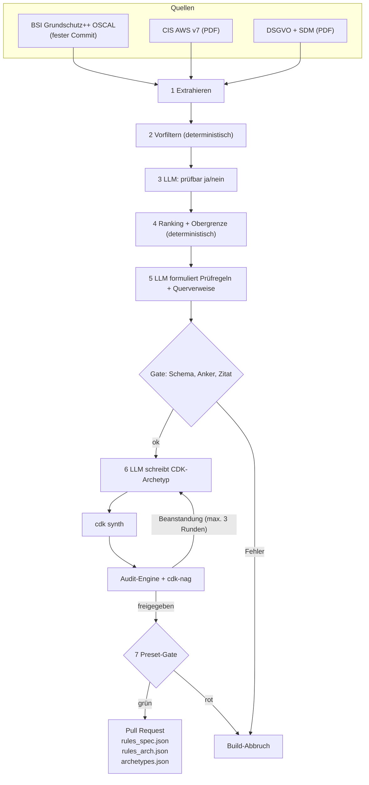
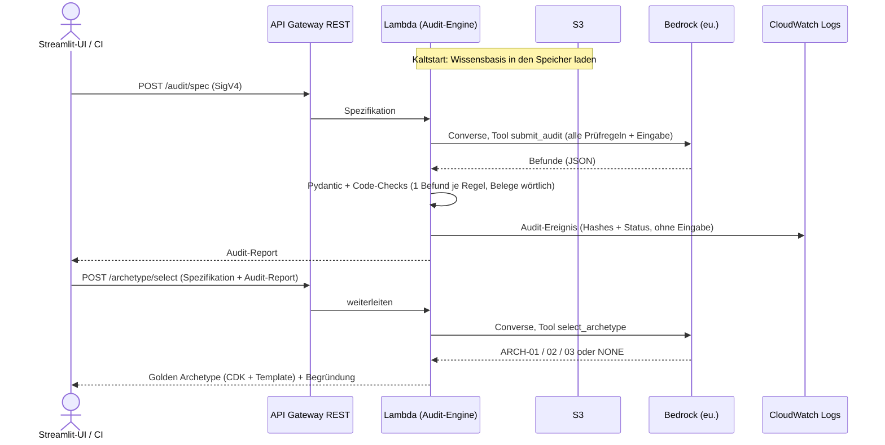
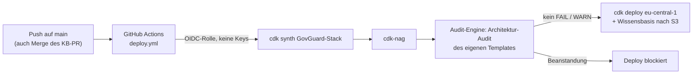
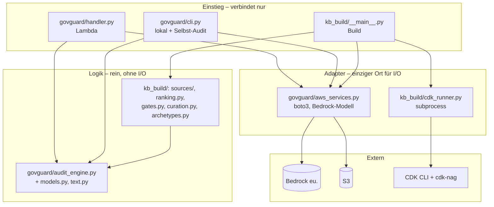

# GovGuard – Big Picture

GovGuard hat zwei Betriebsarten: **Build-Zeit** (Wissensbasis und Golden Archetypes erzeugen) und **Laufzeit** (Audits beantworten). Beide nutzen dieselbe **Audit-Engine**. Begriffe: [CONTEXT.md](../CONTEXT.md), Anforderungen: [SPEC.md](SPEC.md).

## Arbeitsteilung LLM ↔ Code

Testfrage für jede Aufgabe: **Gibt es genau eine richtige Antwort, die sich ohne Sprachverständnis ermitteln lässt?** Ja → Code. Nein → LLM, und danach prüft der Code das Ergebnis.

| Code (deterministisch) | LLM (probabilistisch) |
|---|---|
| zählen, sortieren, nachschlagen, vergleichen | verstehen, bewerten, formulieren |
| Vorfilter, Ranking, Obergrenze | „Ist diese Anforderung prüfbar?“ |
| Primäranker, Querverweis-IDs prüfen, Archetyp-Dateien laden | Prüfregel-Kriterien und Empfehlungen formulieren |
| Zitat steht wörtlich in Quelle/Eingabe? Jede Prüfregel genau ein Befund? | „Verstößt diese Spezifikation gegen Art. 9?“ |
| Gesamtstatus = schlechtester Einzelstatus | Archetyp aus geschlossener Liste wählen |

Das LLM sitzt immer **zwischen zwei Code-Schichten**: Der Code bereitet vor (filtern, auswählen), das LLM urteilt, und der Code kontrolliert (Schema, Vollständigkeit, Zitate). Was der Code schon weiß, erzeugt das LLM nicht. Das hält den Anteil klein, der halluzinieren kann.

## 1. Build-Zeit – Wissensbasis erzeugen (manueller Workflow `build-kb.yml`)



Die Rauten sind **Gates**: automatische Prüfpunkte, an denen Code das Ergebnis des LLM kontrolliert. Fällt etwas durch, bricht der Build ab, und die alte Wissensbasis bleibt aktiv.

Das Build-Skript liest die Quellen ein und siebt sie in zwei Stufen: Ein deterministischer Vorfilter wirft offensichtlich Irrelevantes weg, dann entscheidet das LLM je Anforderung, ob sie an einer Spezifikation oder an Infrastructure as Code (IaC) prüfbar ist. Ein festes Ranking schneidet auf die Obergrenze des Bounded Catalog ab; erst danach formuliert das LLM daraus Prüfregeln.

Das erste Gate prüft jede Prüfregel in drei Punkten:

| Prüfung | Frage | Schützt vor |
|---|---|---|
| Schema | Passt das JSON zum Pydantic-Modell `Rule` (Pflichtfelder, Typen, erlaubte Werte)? | unvollständigen oder kaputten Regeln |
| Anker | Gibt es Primäranker und Querverweise wirklich in der Quelle (1.3)? | erfundenen Fundstellen, z. B. „DET.3.99“ |
| Zitat | Steht `source_quote` wörtlich im Text der verankerten Anforderung (1.3)? | erfundenem oder umformuliertem Normtext |

Den Primäranker setzt zwar der Code, der Check sichert aber die Extraktion ab. Querverweise schlägt dagegen das LLM vor; hier fängt der Check erfundene IDs ab.

Danach entstehen die Golden Archetypes. Das LLM schreibt CDK-Code, `cdk synth` macht daraus ein CloudFormation-Template, und unsere Audit-Engine sowie cdk-nag prüfen dieses Template. Bei Beanstandungen korrigiert das LLM, höchstens dreimal.

Zum Schluss müssen die 4 Presets ihr festgelegtes Soll-Ergebnis liefern. Nur wenn alle Gates grün sind, öffnet der Workflow einen Pull Request mit der neuen Wissensbasis. Nach S3 gelangt sie erst nach dem Merge, über den normalen Deploy (Abschnitt 3). Jeder Fehler bricht den Build ab, und die alte Version bleibt aktiv.

Der Workflow startet nur manuell: Er kostet viele LLM-Aufrufe, liefert bei jedem Lauf leicht andere Texte, und die Quellen ändern sich selten. Kuration und Archetypen laufen immer zusammen, weil die Archetypen gegen die aktuellen Prüfregeln freigegeben werden (1.4).

### 1.1 Sieben: Vorfilter, LLM, Ranking

Jede Quelle durchläuft dieselben drei Stufen; nur die Parameter unterscheiden sich. Leitsatz: **Das LLM urteilt, der Code wählt aus.**

| Quelle | Einheit (Anforderung) | ① Vorfilter (Code) | ② LLM-Frage (ja/nein + Begründung) | ③ Ranking (Code) | Obergrenze |
|---|---|---|---|---|---|
| BSI Grundschutz++ | Control im OSCAL-Katalog, z. B. `DET.3.1` | `modal_verb` = MUSS, `sec_level` = normal-SdT, Praktik ∈ DLS, BER, DET, KONF, BES, ARCH | „An einer Architektur / IaC prüfbar?“ | Summe `confidentiality` + `integrity` + `availability` (0–6) absteigend | 12 |
| CIS AWS v7 | Empfehlung, z. B. `3.1.4` | Kapitel 2 IAM, 3 Storage, 4 Logging | „An einer Architektur / IaC prüfbar?“ | Level 1 vor Level 2, dann *Automated* vor *Manual* | 12 |
| DSGVO | Artikel | Kapitel II–V (Art. 5–49) | „An einer Spezifikation prüfbar?“ | Bußgeldstufe: Art. 83 Abs. 5 (bis 4 %) vor Abs. 4 (bis 2 %) | 12 |
| SDM | Maßnahme, z. B. `M60.D01` | Bausteine Löschen (M60), Trennen (M50), Zugriffe regeln (M51); Ebenen Daten (D) und Systeme (S), nicht Prozesse (P) | „An einer Spezifikation prüfbar?“ | reihum je Baustein, D vor S | 8 |

- **① Vorfilter:** reiner Code auf Metadaten (OSCAL-Props, Kapitelnummern, Artikelnummern, Maßnahmen-IDs). Er ist billig, reproduzierbar und wirft Organisatorisches früh weg.
- **② LLM:** bekommt **eine** Anforderung und antwortet nur ja/nein mit Begründung (per Tool-Choice, siehe 2.1). Es zählt nicht und wählt nicht aus.
- **③ Ranking:** sortiert die „Ja“-Anforderungen nach dem Kriterium der Tabelle, bei Gleichstand nach ID aufsteigend, und schneidet bei der Obergrenze ab. Gleiche Eingabe ergibt dieselbe Reihenfolge. Die Auswahlliste liegt versioniert im Repo; Änderungen zwischen zwei Builds sieht man im Git-Diff.

### 1.2 Prüfregel-Schema

Aus jeder ausgewählten Anforderung formuliert das LLM genau eine Prüfregel (Pydantic-Modell `Rule`). Feldnamen sind englisch, Inhalte deutsch. Beispiel:

```json
{
  "id": "ARCH-CIS-3.1.4",
  "audit_type": "architecture",
  "source": "CIS",
  "primary_anchor": "CIS AWS v7.0.0 3.1.4",
  "source_quote": "Ensure that S3 is configured with 'Block Public Access' enabled",
  "title": "S3 Block Public Access aktiv",
  "compliant_if": "Jeder S3-Bucket hat alle vier Block-Public-Access-Einstellungen aktiv.",
  "violation_if": "Ein Bucket deaktiviert mindestens eine Einstellung.",
  "recommendation": "Am Bucket BlockPublicAccess.BLOCK_ALL setzen.",
  "cfn_resource_types": ["AWS::S3::Bucket"],
  "selection_rationale": "Direkt an der Bucket-Konfiguration im Template prüfbar.",
  "rank": 3,
  "cross_references": [{ "anchor": "BSI GS++ …", "origin": "ai_suggested" }]
}
```

| Feld | Herkunft | Zweck |
|---|---|---|
| `id`, `audit_type`, `source`, `primary_anchor`, `rank` | Code | Identität und Herkunft – das LLM erfindet hier nichts |
| `source_quote` | LLM, vom Code geprüft | Wörtlicher Auszug aus der Quelle (siehe 1.3) |
| `title`, `compliant_if`, `violation_if`, `recommendation` | LLM | Prüfbare Kriterien für PASS/FAIL und die Abhilfe |
| `cfn_resource_types` | LLM, nur Architektur | Für welche CloudFormation-Typen die Regel gilt (sperrt N/A, siehe 1.4) |
| `selection_rationale` | LLM aus Stufe ② | Warum die Anforderung prüfbar ist |
| `cross_references` | LLM, vom Code geprüft | Bezug auf eine andere Quelle; nur `ai_suggested` (KI-vorgeschlagen), ohne Einfluss auf den Status |

### 1.3 Primäranker

Der Primäranker ist die **eine** Anforderung, aus der eine Prüfregel stammt. Ihn setzt der Code, nicht das LLM, denn er kennt die ID aus Stufe ①. Das Gate prüft zwei Dinge:

| Quelle | Format | Existenz-Check |
|---|---|---|
| BSI | `BSI GS++ DET.3.1` + Commit-SHA des Katalogs | ID existiert im Katalog-JSON |
| CIS | `CIS AWS v7.0.0 3.1.4` | Nummer und Titel stehen im PDF-Text |
| DSGVO | `DSGVO Art. 32` (optional Abs./lit.) | Überschrift „Artikel 32“ steht im PDF-Text |
| SDM | `SDM Löschen M60.D01` | Maßnahmen-ID steht im Baustein-Text |

Zusätzlich muss das `source_quote` **wörtlich** im Text genau der verankerten Anforderung stehen, nach Normalisierung von Leerzeichen und Zeilenumbrüchen und nach Entfernen von EUR-Lex-Markern wie „►C2“. Das ist dasselbe Prinzip wie der Beleg zur Laufzeit: Zitat statt Behauptung.

### 1.4 Soll-Ergebnis der Golden Archetypes

Für Presets legt ein Mensch das Soll fest. Für Archetypen ist es **vollautomatisch** und besteht aus drei Bedingungen, die alle erfüllt sein müssen:

1. **Struktur-Soll:** Das Template enthält die Pflicht-Ressourcentypen aus dem Steckbrief des Archetyps (deterministischer Check).
2. **Compliance-Soll:** Jede Architektur-Prüfregel ist PASS oder N/A. N/A ist **verboten**, wenn einer ihrer `cfn_resource_types` im Template vorkommt (Code-Check). So kann das LLM eine unbequeme Regel nicht wegdefinieren.
3. **cdk-nag:** Das Regelpaket AwsSolutions meldet keine Errors. `NagSuppressions` sind im Archetyp-Code verboten (Code-Check).

| Archetyp | Solutions Constructs | Pflicht-Ressourcentypen |
|---|---|---|
| ARCH-01 Sync REST | `aws-apigateway-lambda`, `aws-lambda-dynamodb` | `AWS::ApiGateway::RestApi`, `AWS::Lambda::Function`, `AWS::DynamoDB::Table` |
| ARCH-02 Async Document Ingest | `aws-s3-sqs`, `aws-sqs-lambda` | `AWS::S3::Bucket`, `AWS::SQS::Queue`, `AWS::Lambda::Function` |
| ARCH-03 Audit-Log-Archiv | `aws-kinesisfirehose-s3` | `AWS::KinesisFirehose::DeliveryStream`, `AWS::S3::Bucket` mit `ObjectLockEnabled` |

Die Steckbriefe (Zweck, Constructs, Pflicht-Typen) sind die einzige feste Vorgabe an das LLM. Sie stammen aus [Behörden Cloud-Referenzarchitekturen Analyse](research/Behörden%20Cloud-Referenzarchitekturen%20Analyse.md). ARCH-01 nutzt DynamoDB statt Aurora (wie das Construct-Mapping im Research-Dokument): DynamoDB On-Demand kostet im Leerlauf 0 €.

## 2. Laufzeit – ein Audit



Beim Kaltstart lädt die Lambda-Funktion die Wissensbasis einmal aus S3 in den Speicher, weitere Aufrufe nutzen sie direkt. Für ein Audit schickt sie **alle** Prüfregeln des Bounded Catalog zusammen mit der Eingabe an Bedrock. Das Modell muss über das erzwungene Tool `submit_audit` antworten (Tool-Choice), es kann also nur strukturiertes JSON liefern, keinen Freitext.

Danach prüft der Code, nicht das Modell, das Ergebnis. Pydantic validiert das Schema, und zusätzlich muss jede Prüfregel genau einen Befund haben und jeder Beleg wörtlich in der Eingabe stehen. Erst dann wird der Gesamtstatus berechnet.

Hat das Spec-Audit kein FAIL, kann der Client in einem zweiten Aufruf einen Golden Archetype anfordern. Das Modell wählt dann nur aus einer geschlossenen Liste: ARCH-01, -02, -03 oder `NONE` (keiner). Das Architektur-Audit (`POST /audit/architecture`) läuft genauso wie das Spec-Audit ab, nur mit den Prüfregeln aus BSI und CIS.

### 2.1 Tool-Choice – wie das Modell zur Struktur gezwungen wird

Die Bedrock Converse API erlaubt, dem Modell „Tools“ anzubieten. Jedes Tool hat einen Namen und ein JSON-Schema für seine Eingabe. Mit `toolChoice` erzwingen wir ein Tool. Das Modell darf dann nicht frei antworten, sondern muss dieses Tool mit schema-konformen Argumenten „aufrufen“. Wir führen dabei nichts aus. **Das Tool ist ein Formular**, und seine Argumente sind unser Ergebnis.

Den Aufruf baut Pydantic AI (ADR 0005): Aus dem Draft-Modell entsteht das Tool-Schema, und weil es nur dieses eine Ausgabe-Tool gibt, sendet das Framework `toolChoice: any`, also „ein Tool ist Pflicht“.

```python
# aws_services.py – einziger Ort mit boto3
model = BedrockConverseModel("eu.anthropic.claude-haiku-5-5")   # EU-Profil, ADR 0001

# audit_engine.py – rein, bekommt das Modell übergeben
audit_agent = Agent(
    output_type=ToolOutput(AuditResponse, name="submit_audit",
                           description="Gib genau einen Befund je Prüfregel ab."),
    instructions=SYSTEM_PROMPT,     # Rolle + Regeln für PASS/WARN/FAIL/N/A
    deps_type=AuditDeps,            # Katalog + Eingabe für die Code-Checks
    retries=1,                      # genau ein Retry, 29-s-Timeout
)
result = audit_agent.run_sync(catalog_and_input, model=model, deps=deps)
```

| Tool | Schema (vereinfacht) | Wo |
|---|---|---|
| `classify_requirement` | `testable: bool`, `rationale: str` | Build, Stufe ② |
| `formulate_rule` | LLM-Felder der Prüfregel (siehe 1.2) | Build, Stufe 5 |
| `submit_audit` | `findings: [{rule_id, status: PASS\|WARN\|FAIL\|N/A, evidence, rationale, recommendation}]` | Laufzeit, beide Audits |
| `select_archetype` | `archetype: ARCH-01\|ARCH-02\|ARCH-03\|NONE`, `rationale: str` | Laufzeit, Archetyp-Auswahl |

- **Enums schließen die Antwortmenge:** Das Modell kann keinen Status „OK“ und keinen Archetyp „ARCH-09“ erfinden.
- **Tool-Choice ist kein Beweis:** Das Modell kann trotzdem falsche Werte liefern. Deshalb validiert danach Pydantic, und der Code prüft Vollständigkeit und Belege (`@agent.output_validator`). Bei Fehlern schickt Pydantic AI die Fehlermeldung einmal zurück ans Modell, danach HTTP 502.
- **Was der Code weiß, fragt man das Modell nicht:** Primäranker, Querverweise und Gesamtstatus ergänzt der Code aus der Wissensbasis. Das Modell liefert nur Status, Beleg und Begründung.
- **Modellwahl:** Haiku 5.5 unterstützt erzwungene Tools; Sonnet 5.5 lehnt `toolChoice` = `tool` laut Anthropic-Doku mit HTTP 400 ab. Achtung: Kann ein Modell kein Erzwingen, fällt Pydantic AI still auf `auto` zurück – darum bleibt Haiku 5.5 gesetzt.

## 3. Deployment – GovGuard prüft sich selbst



GovGuard wird selbst mit CDK beschrieben und über GitHub Actions ausgerollt. Die Pipeline meldet sich per OIDC bei AWS an und erhält kurzlebige Rechte, es liegen also keine dauerhaften Zugangsschlüssel in GitHub.

Vor jedem Deploy durchläuft der eigene Stack dieselben zwei Prüfungen wie die Golden Archetypes. Erst prüft cdk-nag deterministisch, dann prüft die Audit-Engine das Template gegen die BSI- und CIS-Prüfregeln. Ein FAIL oder WARN blockiert das Deployment.

So beweist GovGuard an sich selbst, dass seine Regeln erfüllbar sind (Dogfooding).

Es gibt nur **einen Weg in die Produktion**: `deploy.yml`. Er lädt auch die Wissensbasis aus dem Repo nach S3. Darum liegen die Regeln schon vor dem ersten Deploy bereit, und das Selbst-Audit nutzt immer dieselbe Version, die danach live geht.

## Komponenten

| Komponente | Aufgabe | Technik |
|---|---|---|
| Build-Skript | Wissensbasis und Archetypen erzeugen | Python-Paket `kb_build`, CDK CLI |
| Audit-Engine | Prompt bauen, Bedrock aufrufen, Befunde validieren | Python-Modul, Pydantic, Pydantic AI |
| API | 3 Endpunkte, IAM-Auth, Throttling | API Gateway REST + Lambda |
| Wissensbasis | Prüfregeln und Golden Archetypes | JSON in `data/knowledge_base/` (versioniert), per Deploy nach S3 |
| UI | Eingabe, Ampel, Download | Streamlit Community Cloud (ADR 0004) |
| Audit-Protokoll | ein Ereignis je Aufruf, für Auditoren | CloudWatch Logs, KMS, 365 Tage (ADR 0006) |
| Build-Workflow | manuell: Build-Skript ausführen, PR öffnen | GitHub Actions `build-kb.yml` |
| Deploy-Workflow | bei Push: Selbst-Audit, Deploy, Wissensbasis nach S3 | GitHub Actions `deploy.yml`, CDK |

## Code-Struktur

Ein- und Ausgabe (AWS, externe Programme) und Prüflogik liegen in getrennten Dateien. So bleibt der Kern ohne AWS und ohne CDK testbar. Pfeil = „importiert bzw. ruft auf“.



Von der Logik führt **kein Pfeil** zu den Adaptern. Der Einstieg reicht die Adapter hinein, etwa das Bedrock-Modell (Dependency Injection); Tests reichen Fakes bzw. `TestModel` hinein.

Jeder Ordner auf oberster Ebene ist eine eigene Deployment-Einheit oder eine Datenart:

```
src/govguard/         Laufzeit-Kern, wird zum Lambda-Paket
src/kb_build/         Build-Werkzeug: python -m kb_build (importiert govguard, nie umgekehrt)
infra/                CDK-App des GovGuard-Stacks
ui/                   Streamlit-App, spricht nur per HTTP mit der API
data/sources/         Quell-PDFs (CIS, DSGVO, SDM); BSI-OSCAL lädt der Build per Commit-SHA
data/extracted/       extrahierte Anforderungen (JSON)
data/knowledge_base/  rules_spec.json, rules_arch.json, archetypes.json
data/presets/         4 Presets: Eingabedatei + preset.json mit Soll-Ergebnis
data/archetype_profiles.json  Steckbriefe der 3 Archetypen (von Hand gepflegt)
tests/                pytest
.github/workflows/    build-kb.yml, deploy.yml
```

- **Adapter für I/O:** Nur `aws_services.py` importiert boto3 und baut das Bedrock-Modell für Pydantic AI, nur `cdk_runner.py` startet Prozesse. Ein Test prüft beides.
- **Keine Logik in Klebe-Code:** Einstiegsdateien und Workflow-YAML verbinden nur. Ein Workflow meldet sich an, ruft `python -m …` auf und öffnet den PR. Derselbe Befehl läuft lokal.
- **src-Layout:** Der CDK-Stack packt mit `Code.from_asset("src/govguard")` genau den Laufzeit-Kern, ohne Build-Code, UI oder Daten.

## Endpunkte

| Endpunkt | Eingabe → Ausgabe |
|---|---|
| `POST /audit/spec` | Spezifikation → Audit-Report |
| `POST /audit/architecture` | Architektur → Audit-Report |
| `POST /archetype/select` | Spezifikation + Spec-Audit-Report → Golden Archetype oder „keiner“; abgelehnt bei FAIL |

- Getrennte Endpunkte halten jeden Aufruf bei **einem** Bedrock-Call (29-s-Timeout).
- `/archetype/select` vertraut dem mitgesendeten Report: vertretbar, weil Archetypen öffentlich und vorab freigegeben sind.
- Scheitert die Validierung, schickt Pydantic AI die Fehlermeldung einmal zurück ans Modell (`retries=1`), danach HTTP 502.

## Kosten

Der eigene Stack verschlüsselt mit einem kundenverwalteten KMS-Schlüssel (CMK), ca. 1 $/Monat; derselbe Schlüssel schützt auch das Audit-Protokoll. Ein Audit-Ereignis (ca. 2 KB) kostet Bruchteile eines Cents. Regel: **0 € variable Kosten im Leerlauf; Fixkosten nur für Sicherheit.** Satz für die Verteidigung: „Sicherheit hat einen Preis, und ich kann ihn auf den Cent beziffern.“

## Bekannte Grenzen

- **SDM ohne Protokollieren (M43):** Der Baustein V2.0 hat ein eigenes ID-Schema (`M43.21.04`) ohne Ebenen D/S und führt ungültige Maßnahmen nur durchgestrichen weiter. Er bräuchte einen eigenen Parser und fehlt bewusst; Protokollierung prüft das Architektur-Audit (BSI DET, CIS Kapitel 4).
- **DSGVO-Einheit „Artikel“:** Art. 5 ergibt nur eine Prüfregel, obwohl er sechs Grundsätze enthält. Die Grundsätze kommen über das SDM in den Katalog; die SDM-Methode ist genau ihre Operationalisierung (Teil C, „Systematisierung der Anforderungen der DS-GVO durch die Gewährleistungsziele“).
- **Audit-Protokoll nicht revisionssicher:** CloudWatch Logs sind für Admins löschbar, und gespeichert werden nur Hashes und Status, keine Eingaben und vollständigen Reports (ADR 0006). Ein unlöschbarer Speicher für Inhalte widerspräche dem Recht auf Löschung (Art. 17 DSGVO). Auch die Build-Historie in Git ist nicht geschützt: Best Practice wäre eine Branch Protection auf `main` gegen Force-Push und Löschen; sie ist bewusst nicht aktiv, weil der GitHub Free Plan sie für private Repos nicht anbietet.
- **Umfang:** Höchstens 24 bzw. 20 Prüfregeln und Eingaben bis 100.000 Zeichen. Wie GovGuard darüber hinaus wächst, beschreibt [AUSBAU.md](AUSBAU.md).
