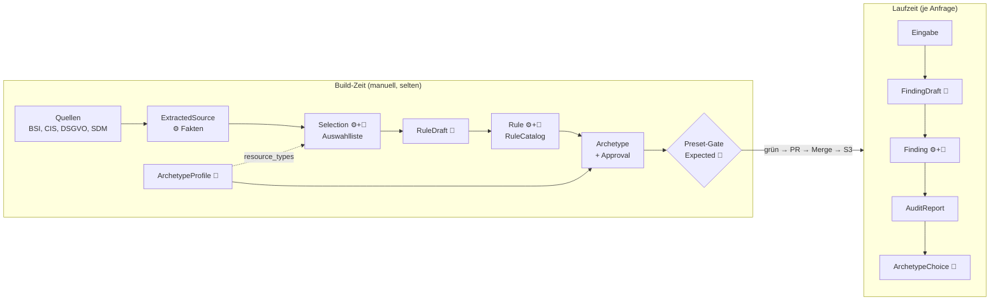

# GovGuard – Das Datenmodell erklärt

> **Lern-Handbuch.** Dieses Dokument ist bewusst länger als die übrige Doku. Es erklärt das *Warum* hinter den Verträgen. Verbindlich bleiben [DESIGN.md](DESIGN.md) (Felder und Signaturen), [ARCHITECTURE.md](ARCHITECTURE.md) (Big Picture) und [CONTEXT.md](../CONTEXT.md) (Begriffe).

**Zielgruppe:** Junior-Entwickler, System-Architekten, IHK-Prüfer.

---

## 0. Das Paradigma in einem Satz

> **Das LLM liefert Entwürfe. Der Code entscheidet, ob daraus Fakten werden.**

Ein Sprachmodell ist gut im Verstehen, Bewerten und Formulieren. Es ist aber **probabilistisch**: Dieselbe Frage kann verschiedene Antworten ergeben, und eine plausibel klingende Antwort kann erfunden sein (**Halluzination**). Für ein Compliance-Werkzeug ist das gefährlich, denn ein erfundener Normverweis in einem Audit-Report ist schlimmer als gar keiner.

GovGuard behandelt deshalb jede LLM-Ausgabe als **unvertrauenswürdige Eingabe**, genau wie ein Formular aus dem Internet. Daraus folgen zwei Prinzipien, die sich durch das ganze Datenmodell ziehen.

### 0.1 Design by Contract

**Design by Contract** (Vertragsprinzip nach Bertrand Meyer) heißt: Jede Schnittstelle legt fest, was sie verlangt und was sie garantiert. In GovGuard sind diese Verträge Pydantic-Modelle und Funktionssignaturen.

- **Vorbedingung** – was beim Aufruf gelten muss. Beispiel: Die Eingabe hat höchstens 100.000 Zeichen, sonst antwortet die API mit HTTP 400.
- **Nachbedingung** – was das Ergebnis garantiert. Beispiel: Genau ein Befund je Prüfregel, und jeder Beleg steht wörtlich in der Eingabe.
- **Invariante** – was immer gilt. Beispiel: Der Gesamtstatus ist der schlechteste Einzelstatus; die Archetypen passen zum Hash des Regelkatalogs.

Der Clou: Das LLM kann diese Verträge nicht garantieren. **Der Code prüft sie**, und zwar jedes Mal.

### 0.2 Das Draft-Pattern

Fast jedes Kernmodell gibt es in GovGuard doppelt:

```
Classification   ──(Code filtert + rankt)──────▶  Selection
RuleDraft        ──(Code prüft + ergänzt)──────▶  Rule
FindingDraft     ──(Code prüft + ergänzt)──────▶  Finding
ArchetypeProfile ──(Build erzeugt + gibt frei)─▶  Archetype
```

- Der **Draft** (Entwurf) enthält *nur* die Felder, die Sprachverständnis brauchen. Aus genau dieser Klasse erzeugt Pydantic das JSON-Schema des Tools, das das LLM ausfüllen muss. Der Draft ist also gleichzeitig **Datenklasse und Formular**.
- Die **Entity** (das fertige Objekt) erbt vom Draft (`class Rule(RuleDraft)`) und ergänzt Felder, die der Code sicher weiß: IDs, Anker, Herkunft, Rang.

> **Begriffsklärung „Entity“:** Im Domain-Driven Design ist eine Entity ein Objekt mit eigener Identität über die Zeit. Hier meint „Entity“ schlicht das **fertige, geprüfte und angereicherte Objekt** im Gegensatz zum rohen Entwurf. Ein `Finding` ist streng genommen ein angereichertes Wertobjekt. Im Fachgespräch passt dafür der Begriff **DTO-zu-Domänenobjekt-Anreicherung**.

Die Leitregel aus ARCHITECTURE.md dahinter: **Was der Code schon weiß, erzeugt das LLM nicht.** Jedes Feld, das das LLM nicht ausfüllen muss, kann es auch nicht falsch ausfüllen.

### 0.3 So liest du die Feld-Steckbriefe

Jedes Feld hat eine Herkunftsmarke in der Überschrift:

- 🤖 **LLM** – geringes Vertrauen, der Code prüft das Feld oder es beeinflusst keine Entscheidung.
- ⚙️ **Code** – deterministisch und reproduzierbar.
- 👤 **Mensch** – von Hand gepflegt und fachlich verantwortet.

Darunter beantwortet jeder Steckbrief dieselben Fragen: **Wer füllt es?** **Warum existiert es?** **Wer liest es, was beeinflusst es?** Wo ein Feld ein konkretes Risiko abfängt, steht es unter **Risiko**.

> **Annahme: Was geht in den Audit-Prompt?** DESIGN.md sagt nur, dass der Katalog „vollständig in den Prompt“ geht. Dieses Handbuch nimmt an: Zur Laufzeit sieht das LLM je Prüfregel nur `id`, `title`, `compliant_if`, `violation_if`, `recommendation` und `cfn_resource_types` – also alles, was es zum Urteilen braucht. `source_quote`, `selection_rationale`, `rank`, `primary_anchor` und `cross_references` dienen der Nachvollziehbarkeit und bleiben draußen. Weniger Text heißt weniger Tokens und weniger Ablenkung. Die endgültige Entscheidung trifft das Audit-Ticket. Bei CloudFormation-Eingabe gehen Prüfregeln ohne passenden Ressourcentyp gar nicht erst in den Prompt (5.6).

---

## 1. Der Lebenszyklus im Überblick



Die Reise der Daten hat fünf Stationen. Die Kapitel 2 bis 6 folgen genau dieser Reihenfolge.

---

## 2. Station 1 – Rohdaten: `ExtractedSource` und `Requirement`

**Aufgabe:** Die Quellen (PDF, OSCAL-JSON) werden in ein einheitliches Format gebracht. Je Quelle entsteht eine Datei `data/extracted/<source>.json`. Hier ist **kein LLM** beteiligt: Station 1 ist das **Fundament der Beweisführung**, denn alles, was später ein LLM behauptet, wird gegen diese Dateien geprüft.

### 2.1 `ExtractedSource` – eine Quelle

#### `source` · ⚙️

**Wer füllt es?** Der Quellen-Adapter, fest im Code verdrahtet: Der CIS-Adapter schreibt immer `"CIS"`.

**Warum existiert es?** Es benennt das Regelwerk mit einem von vier erlaubten Werten (`Literal`). Damit ist ausgeschlossen, dass eine fünfte, unbekannte Quelle unbemerkt in den Build rutscht.

**Wer liest es, was beeinflusst es?** Der Build wählt danach die Parameter für Vorfilter, Ranking und Obergrenze (ARCHITECTURE 1.1) und ordnet die Quelle einer Audit-Art zu: BSI und CIS ergeben Architektur-Prüfregeln, DSGVO und SDM Spec-Prüfregeln. Der Wert landet später in `Rule.source`, als Präfix in `Rule.id` und als Schlüssel in `RuleCatalog.source_versions`.

#### `version` · ⚙️

**Wer füllt es?** Der Adapter, aus der Quelle selbst: `"v7.0.0"` bei CIS, ein Commit-SHA bei BSI, die PDF-Version bei DSGVO und SDM.

**Warum existiert es?** Eine Compliance-Aussage ohne Normfassung ist wertlos. „Erfüllt CIS 3.1.4“ heißt in v7 vielleicht etwas anderes als in v8. Bei BSI fixiert der Commit-SHA den Katalog, weil das Repository keine Releases hat (ADR 0002).

**Wer liest es, was beeinflusst es?** Es wandert in `RuleCatalog.source_versions` und damit in jeden Pull Request. Steigt eine Version, sieht der Reviewer das im Git-Diff. Bei CIS ist die Version zudem Teil des Primärankers (`"CIS AWS v7.0.0 3.1.4"`).

#### `origin` · ⚙️

**Wer füllt es?** Der Adapter: der Pfad in `data/sources/` oder die URL, von der gelesen wurde.

**Warum existiert es?** Für die **Reproduzierbarkeit**: Jeder kann die Extraktion mit genau derselben Datei wiederholen.

**Wer liest es, was beeinflusst es?** Menschen bei der Nachprüfung. Auf Prüfregeln oder Status hat es keinen Einfluss.

#### `requirements` · ⚙️

**Wer füllt es?** Der Adapter, mit **allen** Anforderungen der Quelle – nicht nur mit denen, die den Vorfilter bestehen.

**Warum existiert es?** Das Gate prüft auch **Querverweise**, und die können auf Anforderungen außerhalb der Auswahl zeigen. Ohne die vollständige Liste könnte der Code nicht entscheiden, ob „BSI DET.3.99“ existiert oder erfunden ist.

**Wer liest es, was beeinflusst es?** Vorfilter, LLM-Klassifikation (Stufe ②), Ranking und das Anker-Gate.

### 2.2 `Requirement` – eine Anforderung

#### `id` · ⚙️

**Wer füllt es?** Der Adapter, exakt so, wie die ID in der Quelle steht: `"3.1.4"`, `"DET.3.1"`, `"Art. 32"`, `"M60.D01"`.

**Warum existiert es?** Ein Mensch muss die Anforderung ohne Übersetzung in der Norm wiederfinden. Darum wird die ID nicht vereinheitlicht.

**Wer liest es, was beeinflusst es?** Der Code bildet daraus `Rule.id` (ohne Leerzeichen), das Ranking nutzt es als Gleichstandsregel (ID aufsteigend), und das Anker-Gate sucht danach.

#### `title` · ⚙️

**Wer füllt es?** Der Adapter, aus der Überschrift der Anforderung.

**Warum existiert es?** Es gibt dem LLM und dem Menschen einen schnellen Überblick, worum es geht.

**Wer liest es, was beeinflusst es?** Das LLM in Stufe ② (prüfbar ja/nein) und beim Formulieren der Prüfregel. Bei CIS nutzt der Existenz-Check Nummer und Titel, um die Empfehlung im PDF-Text wiederzufinden (ARCHITECTURE 1.3).

#### `text` · ⚙️

**Wer füllt es?** Der Adapter: der Volltext, schon beim Extrahieren mit `normalize()` bereinigt (Kapitel 7).

**Warum existiert es?** Er ist der **Referenztext**, gegen den das LLM-Zitat geprüft wird. Weil er schon normalisiert gespeichert ist, sieht jeder spätere Check denselben Text.

**Wer liest es, was beeinflusst es?** Das LLM bekommt ihn als Arbeitsmaterial für Stufe ② und für `formulate_rule`. Das Gate prüft mit `contains_quote()`, ob `RuleDraft.source_quote` wörtlich darin steht – und zwar nur im Text **genau dieser** Anforderung.

**Risiko:** halluzinierter oder umformulierter Normtext.

#### `primary_anchor` · ⚙️

**Wer füllt es?** Der Adapter, im festen Format je Quelle, z. B. `"CIS AWS v7.0.0 3.1.4"` oder `"DSGVO Art. 32"`.

**Warum existiert es?** Es ist die **zitierfähige Fundstelle**, so wie ein Jurist sie schreiben würde. Das LLM fasst dieses Feld nie an, denn der Code kennt die Fundstelle schon aus der Extraktion.

**Wer liest es, was beeinflusst es?** Es wird unverändert in `Rule.primary_anchor` und später in `Finding.primary_anchor` kopiert. Das Preset-Gate gleicht `RequiredFinding.anchor` damit ab. Es ist damit das **Bindeglied** zwischen Norm, Prüfregel, Befund und Test.

**Risiko:** erfundene Fundstellen.

#### `attributes` · ⚙️

**Wer füllt es?** Der Adapter, mit reinen Fakten der Quelle: bei BSI z. B. Praktik, Modalverb und Schutzziel-Summe, bei CIS Kapitel, Level und *Automated*.

**Warum existiert es?** Vorfilter und Ranking brauchen Metadaten, die je Quelle verschieden sind. Ein `dict` hält das Modell für alle vier Quellen gleich. Der Preis ist weniger Typsicherheit; die erlaubten Schlüssel dokumentiert die Tabelle in DESIGN 1.1.

**Wer liest es, was beeinflusst es?** Nur `prefilter()` und `ranking.py`. Der Adapter liest, er bewertet nicht. Diese **Trennung von Extraktion und Bewertung** hält jede Stufe einzeln testbar.

#### `prefilter_passed` · ⚙️

**Wer füllt es?** Die reine Funktion `prefilter()`.

**Warum existiert es?** Das Ergebnis wird gespeichert statt jedes Mal neu berechnet. So zeigt der Git-Diff, welche Anforderungen nach einer Regeländerung neu dazukommen oder herausfallen.

**Wer liest es, was beeinflusst es?** Stufe ②: Nur Anforderungen mit `true` gehen an das LLM. Das spart LLM-Aufrufe und wirft Organisatorisches früh und billig weg.

---

## 3. Station 2 – Auswahl und Prüfregel-Fabrik: `Selection` → `RuleDraft` → `Rule`

**Aufgabe:** Aus jeder ausgewählten Anforderung entsteht genau eine prüfbare **Prüfregel**. Welche Anforderungen ausgewählt werden, legt vorher die Auswahlliste fest (3.0).

### 3.0 `Classification` → `Selection` – die Auswahlliste

Bevor Prüfregeln entstehen, legt der Build fest, **welche** Anforderungen in den Bounded Catalog kommen. Das Ergebnis ist die Auswahlliste `data/knowledge_base/selection_<spec|arch>.json`. Sie ist der Kontrollpunkt, an dem ein Mensch die Auswahl im Pull Request prüft, bevor Formulierung und Archetypen Geld kosten (ADR 0007). Der Ablauf je Quelle:

1. **Stufe ② (🤖):** Das LLM füllt je Anforderung das Formular `Classification` (Tool `classify_requirement`).
2. **Relevanz (⚙️, nur Architektur):** Es bleibt nur, was einen Ressourcentyp aus den Steckbriefen betrifft (`resource_types`, 4.1).
3. **Gesetzte Plätze (👤 → ⚙️):** Die Pflichtanker der Presets kommen immer hinein (6.2).
4. **Ranking (⚙️):** Die übrigen Plätze verteilt der Code reihum je Gruppe bis zur Obergrenze.

#### `Classification.testable` · 🤖

**Wer füllt es?** Das LLM: Ist die Anforderung an einer Spezifikation bzw. an einem einzelnen CloudFormation-Template entscheidbar?

**Warum existiert es?** Ob „Sicherheitsrelevante Ereignisse werden protokolliert“ an einem Template prüfbar ist, braucht Sprachverständnis. Zählen und Auswählen macht danach der Code.

**Wer liest es, was beeinflusst es?** Nur „ja“ geht weiter. Ein falsches „nein“ fällt im Review der Auswahlliste auf, ein falsches „ja“ spätestens als Dauer-WARN bei der Freigabe.

#### `Classification.rationale` · 🤖

**Wer füllt es?** Das LLM, als Begründung für „ja“ oder „nein“.

**Warum existiert es?** Ein Ja/Nein ohne Begründung lässt sich nicht überprüfen.

**Wer liest es, was beeinflusst es?** Der Mensch im Pull Request. Bei ausgewählten Anforderungen wird es zu `Rule.selection_rationale` (3.3).

#### `Classification.cfn_resource_types` · 🤖

**Wer füllt es?** Das LLM, nur bei Architektur, z. B. `["AWS::S3::Bucket"]`. Bei Spezifikationen bleibt die Liste leer.

**Warum existiert es?** Es sagt maschinenlesbar, welche CloudFormation-Typen eine Anforderung betrifft. Damit kann der Code drei Dinge ohne Sprachverständnis entscheiden: Relevanz für unsere Archetypen, die Gruppe im Ranking und N/A im Audit.

**Wer liest es, was beeinflusst es?** Der Relevanzfilter (Schnittmenge mit `resource_types`), das Ranking (eine Regel zählt für den ersten Typ ihrer Liste) und später `Rule.cfn_resource_types` (3.3). Eine Anforderung ohne Typ, etwa Root-MFA, fällt heraus: Sie ist an keinem Template entscheidbar.

**Risiko:** Ein falscher Typ führt zu einem stillen N/A, weil der Code die Regel dann für nicht anwendbar hält. Darum stehen die Typen in der Auswahlliste und werden im Pull Request geprüft.

#### `SelectedRequirement.pinned` · ⚙️ (aus 👤)

**Wer füllt es?** Der Code: `true`, wenn der Primäranker in den `required_findings` eines Presets steht.

**Warum existiert es?** Fachlich zentrale Normen wie DSGVO Art. 32 dürfen nicht an einer Hilfsgröße wie der Bußgeldstufe scheitern. Das Feld macht sichtbar, ob eine Regel gesetzt oder gerankt wurde.

**Wer liest es, was beeinflusst es?** Das Ranking vergibt gesetzte Plätze zuerst; sie zählen zur Obergrenze ihrer Quelle. Der Mensch sieht im Pull Request, welche Regeln nicht aus dem Ranking stammen.

**Risiko:** ein Katalog, der nur auf die Tests zugeschnitten ist. Darum gibt es höchstens 4 gesetzte Plätze je Audit-Art.

#### `SelectedRequirement.rank` · ⚙️

**Wer füllt es?** `ranking.py`: zuerst die gesetzten Plätze, dann reihum je Gruppe (Architektur: Ressourcentyp; Spezifikation: DSGVO-Kapitel bzw. SDM-Baustein), innerhalb einer Gruppe nach dem Kriterium aus ARCHITECTURE 1.1, bei Gleichstand nach ID.

**Warum existiert es?** Einfaches Sortieren verzerrt: Beim BSI haben 24 von 30 Kandidaten dieselbe CIA-Summe, dann gewinnt das Alphabet. „Reihum“ sorgt für Breite und bleibt reproduzierbar.

**Wer liest es, was beeinflusst es?** Der Schnitt bei der Obergrenze und später `Rule.rank`.

### 3.1 `RuleDraft` – was das LLM liefert (Tool `formulate_rule`)

#### `source_quote` · 🤖 → ⚙️ geprüft

**Wer füllt es?** Das LLM. Es soll den Satz aus der Norm abschreiben, aus dem es die Prüfregel ableitet.

**Warum existiert es?** Es ist der **Herkunftsnachweis** der Prüfregel. Ohne Zitat könnte das LLM eine plausibel klingende, aber erfundene Vorgabe formulieren, und niemand würde es merken.

**Wer liest es, was beeinflusst es?** Das Build-Gate prüft mit `contains_quote()`, ob das Zitat wörtlich im `text` der verankerten Anforderung steht. Fehlt es dort, bricht der Build ab. Danach liest es der Mensch im Pull Request, um die Regel gegen die Norm zu halten. Laut Annahme (0.3) geht es nicht in den Audit-Prompt und beeinflusst keinen Status.

**Risiko:** halluzinierter Normtext.

#### `title` · 🤖

**Wer füllt es?** Das LLM, als kurze deutsche Überschrift, z. B. „S3 Block Public Access aktiv“.

**Warum existiert es?** Normtitel sind oft lang, englisch oder juristisch. Der Report braucht eine Zeile, die ein Architekt sofort versteht.

**Wer liest es, was beeinflusst es?** Das LLM im Audit-Prompt als Orientierung. Danach kopiert der Code es in `Finding.title`, und der Nutzer sieht es in UI und Report. Auf den Status hat es keinen direkten Einfluss.

#### `compliant_if` · 🤖

**Wer füllt es?** Das LLM, einmalig zur Build-Zeit.

**Warum existiert es?** Es übersetzt Normsprache in ein **prüfbares Kriterium**: Was muss in der Eingabe stehen, damit die Regel als erfüllt gilt? Ohne dieses Feld müsste das LLM die Norm in jedem Audit neu auslegen – und würde das jedes Mal etwas anders tun.

**Wer liest es, was beeinflusst es?** Das LLM im Audit-Prompt. Es ist der Maßstab für PASS und beeinflusst damit direkt den Status. Weil es versioniert im Katalog liegt, kann ein Mensch im Pull Request prüfen, ob das Kriterium die Norm richtig trifft.

#### `violation_if` · 🤖

**Wer füllt es?** Das LLM, einmalig zur Build-Zeit.

**Warum existiert es?** Es ist das Gegenstück zu `compliant_if` und beschreibt, wann ein **Verstoß belegt** ist. Beide Kriterien zusammen schaffen eine dritte Zone: Trifft keines von beiden eindeutig zu, ist der Befund WARN.

**Wer liest es, was beeinflusst es?** Das LLM im Audit-Prompt; es ist der Maßstab für FAIL. Ein FAIL blockiert die Archetyp-Auswahl und lässt eine CI-Pipeline rot werden.

**Risiko:** ein FAIL, das nur auf fehlender Information beruht. Das explizite Kriterium zwingt das LLM, einen Verstoß *nachzuweisen*.

#### `recommendation` · 🤖

**Wer füllt es?** Das LLM: die Standard-Abhilfe, z. B. „Am Bucket `BlockPublicAccess.BLOCK_ALL` setzen“.

**Warum existiert es?** Ein Audit ohne Abhilfe sagt nur, *dass* etwas fehlt. Die vorformulierte Empfehlung hält die Ratschläge über viele Audits hinweg einheitlich.

**Wer liest es, was beeinflusst es?** Das LLM im Audit-Prompt als Vorlage für `FindingDraft.recommendation`, das sie auf die konkrete Eingabe zuschneiden darf. In den Report wird sie nicht direkt kopiert.

#### `cross_references` · 🤖 → ⚙️ geprüft

**Wer füllt es?** Das LLM: Bezüge auf Anforderungen **anderer** Quellen, z. B. von einer CIS-Regel zu einem BSI-Control.

**Warum existiert es?** Ein Prüfer sieht gern, dass dieselbe Sache in mehreren Normen verlangt wird. Das zu finden, braucht Sprachverständnis – also LLM-Arbeit.

**Wer liest es, was beeinflusst es?** Das Anker-Gate prüft, ob jedes Ziel in `data/extracted/` existiert. Danach kopiert der Code die Querverweise in `Finding.cross_references`, und der Nutzer sieht sie als Hinweis. Auf den Status haben sie **keinen** Einfluss.

### 3.2 `CrossReference` – ein Querverweis

#### `anchor` · 🤖 → ⚙️ geprüft

**Wer füllt es?** Das LLM, im Primäranker-Format der Zielquelle.

**Warum existiert es?** Das einheitliche Format macht den Querverweis maschinell prüfbar: Der Code kann ihn mit den `primary_anchor`-Werten der extrahierten Anforderungen vergleichen.

**Wer liest es, was beeinflusst es?** Das Anker-Gate; ein unbekannter Anker bricht den Build ab. Danach nur noch der Mensch im Report.

**Risiko:** erfundene Fundstellen wie „DET.3.99“.

#### `origin` · 🤖 (fester Wert)

**Wer füllt es?** Formal das LLM, aber das Schema erlaubt nur einen Wert: `"ai_suggested"`.

**Warum existiert es?** Ein Feld mit nur einem möglichen Wert wirkt überflüssig. Es ist aber ein **ehrliches Etikett**: Der Code prüft nur, dass das Ziel existiert, nicht, ob der Bezug inhaltlich stimmt. Das Feld macht diese Unsicherheit im Datenmodell sichtbar. Kommt später eine menschliche Prüfung hinzu, kann ein zweiter Wert wie `"human_verified"` folgen, ohne das Format zu brechen.

**Wer liest es, was beeinflusst es?** Der Mensch im Report. Es verhindert, dass ein KI-Vorschlag als verifiziertes Mapping missverstanden wird.

**Risiko:** **Scheinpräzision** – ein unbelegter Bezug, der wie ein geprüfter aussieht.

### 3.3 `Rule` – was der Code ergänzt

#### `id` · ⚙️

**Wer füllt es?** Der Code, nach dem Schema `<SPEC|ARCH>-<SOURCE>-<Requirement.id ohne Leerzeichen>`, z. B. `ARCH-CIS-3.1.4` oder `SPEC-DSGVO-Art.32`.

**Warum existiert es?** Jede Prüfregel braucht einen **stabilen, eindeutigen Schlüssel**. Weil die ID aus der Anforderung abgeleitet wird, bleibt sie über Builds gleich, solange die Anforderung gleich bleibt. Das LLM kann keine Kollision und keine Fantasie-ID erzeugen.

**Wer liest es, was beeinflusst es?** Das LLM bekommt sie im Audit-Prompt und muss sie in `FindingDraft.rule_id` zurückgeben. `run_audit()` prüft damit die Vollständigkeit und schlägt über sie die Katalogdaten für die Anreicherung nach.

#### `audit_type` · ⚙️

**Wer füllt es?** Der Code, abgeleitet aus der Quelle (BSI/CIS → `"architecture"`, DSGVO/SDM → `"spec"`).

**Warum existiert es?** Die Prüfregel weiß selbst, in welchen Katalog sie gehört. Dadurch ist auch klar, dass `cfn_resource_types` bei `"spec"` leer bleiben muss.

**Wer liest es, was beeinflusst es?** Der Build, der die Regeln auf `rules_spec.json` und `rules_arch.json` verteilt.

#### `source` · ⚙️

**Wer füllt es?** Der Code, aus `ExtractedSource.source` übernommen.

**Warum existiert es?** Damit eine Prüfregel ohne Rückgriff auf andere Dateien sagt, aus welchem Regelwerk sie stammt.

**Wer liest es, was beeinflusst es?** Die ID-Bildung, der Abgleich mit `RuleCatalog.source_versions` und der Mensch beim Lesen des Katalogs.

#### `primary_anchor` · ⚙️

**Wer füllt es?** Der Code, unverändert aus dem `Requirement` übernommen – **nie** das LLM.

**Warum existiert es?** Es ist die eine Anforderung, aus der die Prüfregel stammt. Das Anker-Gate prüft es trotzdem noch einmal, um die Extraktion abzusichern.

**Wer liest es, was beeinflusst es?** Es wird in `Finding.primary_anchor` kopiert und erscheint im Report. Das Preset-Gate gleicht es mit `RequiredFinding.anchor` ab.

#### `selection_rationale` · 🤖 (aus Stufe ②), ⚙️ übernommen

**Wer füllt es?** Ursprünglich das LLM im Tool `classify_requirement`, als Begründung für „prüfbar: ja“. Der Code übernimmt den Text über die Auswahlliste (3.0) unverändert in die Prüfregel.

**Warum existiert es?** **Nachvollziehbarkeit der Auswahl:** Ein Prüfer fragt, warum genau diese 24 Regeln und nicht andere im Katalog stehen. Die Antwort steht direkt an der Regel.

**Wer liest es, was beeinflusst es?** Der Mensch im Pull Request. Laut Annahme (0.3) geht es nicht in den Audit-Prompt und beeinflusst keinen Status.

#### `rank` · ⚙️

**Wer füllt es?** Der Code, aus der Auswahlliste übernommen (`SelectedRequirement.rank`, 3.0).

**Warum existiert es?** Es macht die Auswahl reproduzierbar: Gleiche Eingabe ergibt dieselbe Reihenfolge und denselben Schnitt bei der Obergrenze.

**Wer liest es, was beeinflusst es?** Der Mensch sieht die Priorität. Laut Annahme (0.3) bekommt das LLM den Rang nicht, damit es Regeln mit hohem Rang nicht als „unwichtig“ behandelt.

#### `cfn_resource_types` · 🤖 (aus Stufe ②), ⚙️ übernommen

**Wer füllt es?** Der Code, aus der Auswahlliste übernommen (3.0). Bei Spec-Prüfregeln bleibt die Liste leer.

**Warum existiert es?** Zur Laufzeit muss die Prüfregel selbst wissen, für welche CloudFormation-Typen sie gilt.

**Wer liest es, was beeinflusst es?** `run_audit()`: Kommt bei CloudFormation-Eingabe keiner der Typen im Template vor, setzt der **Code** N/A (5.6). Kommt einer vor, ist N/A vom LLM **verboten**. Dieselbe Regel gilt bei der Freigabe der Golden Archetypes. Im Audit-Prompt hilft es dem LLM laut Annahme (0.3), die Anwendbarkeit zu beurteilen.

**Risiko:** Das LLM definiert eine unbequeme Regel als „nicht anwendbar“ weg.

#### `pinned` · ⚙️

**Wer füllt es?** Der Code, aus der Auswahlliste übernommen (3.0).

**Warum existiert es?** Auch im fertigen Katalog soll sichtbar bleiben, welche Prüfregeln ein Preset gesetzt hat.

**Wer liest es, was beeinflusst es?** Nur der Mensch. Auf den Status hat es keinen Einfluss.

### 3.4 `RuleCatalog` – die Datei `rules_spec.json` bzw. `rules_arch.json`

#### `audit_type` · ⚙️

**Wer füllt es?** Der Build.

**Warum existiert es?** Je Audit-Art gibt es genau einen **Bounded Catalog**. Das Feld macht jede Datei selbstbeschreibend.

**Wer liest es, was beeinflusst es?** Die Lambda-Funktion lädt beim Kaltstart beide Kataloge und nutzt je Endpunkt den passenden.

#### `source_versions` · ⚙️

**Wer füllt es?** Der Build, aus `ExtractedSource.version`, z. B. `{"CIS": "v7.0.0", "BSI": "<SHA>"}`.

**Warum existiert es?** Jede Audit-Aussage muss auf eine konkrete Normfassung zurückführbar sein.

**Wer liest es, was beeinflusst es?** Der Reviewer im Pull Request. Ein Versionssprung erklärt auf einen Blick, warum sich viele Regeln geändert haben.

#### `model_id` · ⚙️

**Wer füllt es?** Der Build, mit dem tatsächlich verwendeten Modell.

**Warum existiert es?** **KI-Governance:** Es muss nachweisbar sein, welches Modell die Prüfregeln formuliert hat. Ein Modellwechsel erklärt im Diff, warum sich Formulierungen geändert haben.

**Wer liest es, was beeinflusst es?** Der Mensch bei Review und Audit-Nachfragen. Auf den Status hat es keinen Einfluss.

#### `rules` · ⚙️ + 🤖

**Wer füllt es?** Der Build: nur Prüfregeln, die das Gate bestanden haben.

**Warum existiert es?** Es ist der Bounded Catalog selbst: fest begrenzt (24 bzw. 20 Regeln) und in **jedem** Audit vollständig bewertet (ADR 0002).

**Wer liest es, was beeinflusst es?** Der Audit-Prompt, die Vollständigkeitsprüfung in `run_audit()` und die Anreicherung der Befunde.

> **Bewusst ohne Zeitstempel:** Ein unveränderter Build soll **keinen Git-Diff** erzeugen. So sieht der Reviewer im Pull Request nur echte inhaltliche Änderungen.

### 3.5 Das Gate: vom Entwurf zur Prüfregel

Bevor eine Regel in den Katalog darf, prüft der Code drei Punkte:

1. **Schema:** Passt das JSON zum Modell?
2. **Anker:** Gibt es den Primäranker und jeden Querverweis wirklich in `data/extracted/`?
3. **Zitat:** Steht `source_quote` wörtlich im `text` **genau der verankerten Anforderung**?

Der dritte Punkt ist subtil: Ein Zitat aus Art. 5 darf eine Regel zu Art. 32 nicht „belegen“. Darum prüft das Gate nur gegen die eine Anforderung, nicht gegen die ganze Quelle.

---

## 4. Station 3 – Architektur-Schablonen: `ArchetypeProfile` → `Archetype`

**Aufgabe:** Drei **Golden Archetypes** entstehen zur Build-Zeit als CDK-Code und werden vorab freigegeben. Zur Laufzeit wird nichts mehr generiert, nur ausgewählt (ADR 0003).

### 4.1 `ArchetypeProfile` – der Steckbrief (👤, `data/archetype_profiles.json`)

#### `id` · 👤

**Wer füllt es?** Ein Mensch, aus einer geschlossenen Menge: `"ARCH-01"`, `"ARCH-02"`, `"ARCH-03"`.

**Warum existiert es?** Das `Literal` schließt die Menge. Weder der Build noch die Laufzeit-Auswahl können einen vierten Archetyp erfinden.

**Wer liest es, was beeinflusst es?** `ArchetypeChoice.archetype` (das LLM wählt eine dieser IDs), `Expected.archetype` im Preset-Gate und die API, die über die ID CDK-Code und Template nachschlägt.

#### `name` · 👤

**Wer füllt es?** Ein Mensch, z. B. „Sync REST“.

**Warum existiert es?** Eine ID wie „ARCH-02“ sagt einem Menschen nichts.

**Wer liest es, was beeinflusst es?** Der Nutzer in der UI und das LLM als Kurzbeschreibung. Keine Prüflogik hängt daran.

#### `purpose` · 👤

**Wer füllt es?** Ein Mensch, auf Deutsch: Für welches Behörden-Workload-Muster ist der Archetyp gedacht?

**Warum existiert es?** Es ist die **Auswahlgrundlage**. Ein Mensch schreibt es, damit das LLM seine eigenen Auswahlkriterien nicht selbst festlegt.

**Wer liest es, was beeinflusst es?** Zweimal das LLM: im Build als Auftrag („baue eine Architektur für diesen Zweck“) und zur Laufzeit in `select_archetype()`, um die Spezifikation dem passenden Archetyp zuzuordnen. Die Qualität der Auswahl hängt direkt an diesem Text.

#### `constructs` · 👤

**Wer füllt es?** Ein Mensch, z. B. `["aws-apigateway-lambda", "aws-lambda-dynamodb"]`.

**Warum existiert es?** AWS Solutions Constructs bringen geprüfte Sicherheits-Defaults mit (z. B. Verschlüsselung, Logging). Statt freiem IaC baut das LLM aus vorgegebenen, bewährten Bausteinen (ADR 0003).

**Wer liest es, was beeinflusst es?** Das LLM im Build, als Vorgabe für den CDK-Code. Ob die richtige Struktur entsteht, prüft der Code über `required_resource_types`.

#### `required_resource_types` · 👤

**Wer füllt es?** Ein Mensch, z. B. `["AWS::S3::Bucket", "AWS::SQS::Queue", "AWS::Lambda::Function"]`.

**Warum existiert es?** Es ist das **Struktur-Soll**. Ohne dieses Feld könnte das LLM eine „perfekt sichere“ Architektur liefern, die einfach die Datenbank weglässt – keine Ressource, kein Verstoß.

**Wer liest es, was beeinflusst es?** Ein deterministischer Check auf das synthetisierte Template. Fehlt ein Typ, gibt es keine Freigabe. Beim Audit-Log-Archiv verlangt ARCHITECTURE 1.4 zusätzlich `ObjectLockEnabled` am Bucket.

**Risiko:** Sicherheit durch Weglassen.

#### `resource_types` · 👤

**Wer füllt es?** Ein Mensch: die Pflicht-Typen plus die Typen, die jeder Archetyp mitbringt, also `AWS::IAM::Role`, `AWS::KMS::Key` und `AWS::Logs::LogGroup`.

**Warum existiert es?** Es definiert, was „relevant“ heißt: Nur Anforderungen, die einen dieser Typen betreffen, kommen in den Architektur-Katalog (ADR 0007). Ohne IAM, KMS und Logs wären fast alle Befunde eines Archetyps N/A, und die Freigabe hätte wenig Aussagekraft.

**Wer liest es, was beeinflusst es?** Der Relevanzfilter beim Bau der Auswahlliste (3.0).

**Risiko:** Prüfregeln ohne Bezug zu unseren Bausteinen, die nur N/A oder Dauer-WARN liefern.

### 4.2 `Archetype` – das Build-Ergebnis

#### `cdk_code` · 🤖

**Wer füllt es?** Das LLM: Python-CDK in einer Datei.

**Warum existiert es?** Der Nutzer bekommt einen **Startpunkt zum Weiterbauen**, nicht nur ein Bild der Architektur.

**Wer liest es, was beeinflusst es?** `cdk synth` (über `cdk_runner.py`) erzeugt daraus das Template. Ein Code-Check verbietet `Validations.of(...).acknowledge(...)` im LLM-Code (cdk-nag 3); Ausnahmen kommen nur aus der Allowlist (4.5). Über `POST /archetype/select` geht der Code an den Nutzer.

**Risiko:** Das LLM schaltet die Prüfung ab, statt das Problem zu lösen.

#### `template` · ⚙️

**Wer füllt es?** `cdk synth`, also deterministische Werkzeuge, nicht das LLM.

**Warum existiert es?** Geprüft wird das **Template, nicht der Code**. Solutions Constructs verbergen ihre Sicherheits-Defaults im Code; erst im Template sieht man, ob ein Bucket wirklich verschlüsselt ist.

**Wer liest es, was beeinflusst es?** Die Audit-Engine, cdk-nag, der Struktur-Check sowie N/A durch Code und die N/A-Sperre (über `cfn_resource_types`). Danach geht es zusammen mit dem Code an den Nutzer.

#### `approval` · ⚙️

**Wer füllt es?** Der Build, nach bestandener Freigabe-Schleife.

**Warum existiert es?** Die Freigabe soll kein bloßer Zustand sein („ist freigegeben“), sondern ein **Nachweis**, der mitgeliefert wird. Siehe 4.3.

**Wer liest es, was beeinflusst es?** Der Reviewer im Pull Request und jeder, der später fragt: „Woher wisst ihr, dass der Archetyp sicher ist?“

### 4.3 `Approval` – der Freigabe-Nachweis

#### `audit_report` · ⚙️ + 🤖

**Wer füllt es?** Die Audit-Engine – also derselbe `run_audit()` wie zur Laufzeit –, angewandt auf das Template mit dem Architektur-Katalog.

**Warum existiert es?** Es belegt, dass der Archetyp **unsere eigenen Regeln** erfüllt. Erlaubt sind nur PASS und N/A, und N/A setzt dabei nur der Code; schon ein WARN verhindert die Freigabe.

**Wer liest es, was beeinflusst es?** Der Build entscheidet damit über Freigabe oder Korrekturrunde; die Befunde zeigen dem LLM, was es korrigieren soll (Annahme; das Archetyp-Ticket entscheidet die Details). Danach dient es als Nachweis im Pull Request.

#### `cdk_nag_errors` · ⚙️

**Wer füllt es?** cdk-nag mit dem Regelpaket AwsSolutions, nach Abzug der Ausnahmen (4.5).

**Warum existiert es?** Die Audit-Engine nutzt ein LLM. Gäbe sie allein frei, prüfte ein LLM das Werk eines LLM. cdk-nag ist rein regelbasiert und damit **unabhängig**: Vier-Augen-Prinzip für Infrastructure as Code. Die Liste muss leer sein. Eine leere Liste ist trotzdem eine Aussage: „cdk-nag lief und fand nichts“ – ein fehlendes Feld ließe offen, ob es überhaupt lief.

**Wer liest es, was beeinflusst es?** Der Build (leer → weiter, sonst Korrekturrunde) und der Reviewer.

**Risiko:** LLM prüft LLM.

#### `nag_exceptions` · ⚙️

**Wer füllt es?** Der Build: die Ausnahmen, die beim Archetyp tatsächlich gegriffen haben, als `"<rule_id> <path>"`.

**Warum existiert es?** Eine Freigabe „ohne Errors“ ist nur ehrlich, wenn sichtbar ist, welche Errors per Ausnahme erlaubt wurden.

**Wer liest es, was beeinflusst es?** Der Reviewer im Pull Request. Keine Prüflogik hängt daran.

#### `rounds` · ⚙️

**Wer füllt es?** Der Build zählt die Korrekturrunden: 1 bis 3.

**Warum existiert es?** Die Freigabe-Schleife lautet: LLM schreibt → `synth` → Prüfung → Beanstandung → LLM korrigiert. Ohne Obergrenze droht eine **Endlosschleife**, die Geld kostet und nie konvergiert. Nach drei Runden bricht der Build ab, und die alte Wissensbasis bleibt aktiv.

**Wer liest es, was beeinflusst es?** Der Mensch im Review: Ein Archetyp, der drei Runden brauchte, verdient einen zweiten Blick. Es ist ein einfacher **Qualitätsindikator** für die Arbeit des LLM.

**Risiko:** Endlosschleife und unkontrollierte Kosten.

### 4.4 `ArchetypeCatalog` – die Datei `archetypes.json`

#### `rules_arch_sha256` · ⚙️

**Wer füllt es?** Der Build: der SHA-256-Hash der Datei `rules_arch.json`, gegen die freigegeben wurde.

**Warum existiert es?** Archetypen sind nur gegen **einen bestimmten** Regelkatalog freigegeben. Ändert sich der Katalog, ist die Freigabe wertlos. Der Hash macht diese Abhängigkeit maschinell prüfbar.

**Wer liest es, was beeinflusst es?** Das Preset-Gate. Passt der Hash nicht zur Datei daneben, schlägt es fehl.

**Risiko:** veraltete Freigabe, z. B. wenn jemand nur den Regelkatalog neu baut und die alten Archetypen behält.

#### `archetypes` · ⚙️ + 🤖

**Wer füllt es?** Der Build, ausschließlich mit freigegebenen Archetypen.

**Warum existiert es?** Es ist der Teil der Wissensbasis, aus dem zur Laufzeit nur noch ausgewählt wird.

**Wer liest es, was beeinflusst es?** Die Lambda-Funktion lädt es beim Kaltstart. `POST /archetype/select` liefert daraus Code und Template.

### 4.5 `NagException` – eine Ausnahme (👤, `data/nag_allowlist.json`)

Mit Solutions Constructs ist „null cdk-nag-Errors“ nicht erreichbar: CDK erzeugt eigene Hilfs-Ressourcen, die unser Code nicht ändern kann (ADR 0007, ARCHITECTURE 1.4). Die Allowlist macht daraus **dokumentierte Abweichungen**. Sie gilt für Archetypen und den GovGuard-Stack.

#### `rule_id` · 👤

**Wer füllt es?** Ein Mensch, z. B. `"AwsSolutions-IAM4"`.

**Warum existiert es?** Eine Ausnahme gilt immer nur für **eine** Regel, nie pauschal.

**Wer liest es, was beeinflusst es?** Der Code, der die Errors von cdk-nag filtert.

#### `path_pattern` · 👤

**Wer füllt es?** Ein Mensch: ein Glob-Muster auf den Construct-Pfad, z. B. `"*/BucketNotificationsHandler*/Role/Resource"`.

**Warum existiert es?** Die Ausnahme soll nur die eine CDK-interne Ressource treffen. Dieselbe Regel an einer eigenen Ressource bleibt ein Error.

**Wer liest es, was beeinflusst es?** Derselbe Filter.

#### `reason` · 👤

**Wer füllt es?** Ein Mensch, auf Deutsch.

**Warum existiert es?** Eine Abweichung ohne Begründung ist im BSI-Sinn nicht dokumentiert. Die Begründung ist die **Risikoakzeptanz**.

**Wer liest es, was beeinflusst es?** Der Reviewer und der Prüfer. Keine Prüflogik hängt daran.

**Risiko:** Das LLM schaltet die Prüfung ab. Darum schreibt nur ein Mensch die Liste, und der Code wendet sie an (**Funktionstrennung**).

---

## 5. Station 4 – Das Laufzeit-Audit: `FindingDraft` → `Finding` → `AuditReport`

**Aufgabe:** Eine Spezifikation oder Architektur wird gegen den Bounded Catalog geprüft. Hier zeigt sich das Draft-Pattern am deutlichsten.

### 5.1 `Status` – die vier erlaubten Urteile

`Status = Literal["PASS", "WARN", "FAIL", "N/A"]`. Die Bedeutung kommt aus dem Glossar:

- **PASS** – Einhaltung *belegt*.
- **WARN** – aus der Eingabe nicht entscheidbar, Prüfbedarf.
- **FAIL** – Verstoß *belegt*.
- **N/A** – nicht anwendbar.

Weil der Typ im Tool-Schema steht, kann das LLM keinen Status „OK“ oder „teilweise“ erfinden. Die Enum **schließt die Antwortmenge**.

### 5.2 `FindingDraft` – was das LLM liefert (ein Element im Tool `submit_audit`)

#### `rule_id` · 🤖 → ⚙️ geprüft

**Wer füllt es?** Das LLM, indem es die ID der Prüfregel aus dem Prompt zurückgibt.

**Warum existiert es?** Es ist der **Verknüpfungsschlüssel** zwischen Urteil und Katalog. Auf die Reihenfolge der LLM-Antwort verlässt sich der Code nicht; die explizite ID macht die Zuordnung eindeutig.

**Wer liest es, was beeinflusst es?** `run_audit()` prüft, dass jede an das Modell gesendete ID genau einmal vorkommt und keine unbekannte dabei ist. Danach schlägt der Code über die ID Titel, Anker und Querverweise nach.

**Risiko:** vergessene oder erfundene Prüfregeln.

#### `status` · 🤖

**Wer füllt es?** Das LLM, auf Basis von `compliant_if` und `violation_if`. Bei CloudFormation-Eingabe setzt N/A nur der Code (5.6).

**Warum existiert es?** Es ist das eigentliche Urteil – die einzige Stelle, an der wirklich Sprachverständnis nötig ist.

**Wer liest es, was beeinflusst es?** Sehr viel. Der Code bildet daraus `overall_status`. Ein FAIL blockiert die Archetyp-Auswahl (HTTP 422). Bei PASS und FAIL wird ein Beleg Pflicht, bei WARN und FAIL eine Empfehlung. Im Build entscheidet es über die Freigabe eines Archetyps.

#### `evidence` · 🤖 → ⚙️ geprüft

**Wer füllt es?** Das LLM: ein **wörtliches Zitat** aus der Eingabe. Bei WARN und N/A darf es `None` sein.

**Warum existiert es?** Es ist der **Beleg**. PASS heißt „Einhaltung belegt“, FAIL heißt „Verstoß belegt“ – beides braucht ein Zitat. Fehlt eine Information in der Eingabe, ist das WARN, nicht FAIL. So kann das LLM aus **Abwesenheit** keinen Verstoß konstruieren.

**Wer liest es, was beeinflusst es?** `run_audit()` prüft, dass der Beleg vorhanden ist, wo er Pflicht ist, und mit `contains_quote()` wörtlich in der Eingabe steht. Danach sieht der Nutzer ihn im Report und kann das Urteil selbst nachprüfen.

**Risiko:** halluzinierte Belege.

#### `rationale` · 🤖

**Wer füllt es?** Das LLM, in eigenen Worten.

**Warum existiert es?** Ein Zitat allein erklärt nicht, *warum* es die Regel erfüllt oder verletzt. Bei WARN sagt die Begründung, welche Information fehlt.

**Wer liest es, was beeinflusst es?** Nur der Mensch. Der Code prüft den Inhalt nicht, darum hängt auch keine Entscheidung daran.

#### `recommendation` · 🤖

**Wer füllt es?** Das LLM, auf Basis der Standard-Empfehlung der Prüfregel und zugeschnitten auf die Eingabe. Pflicht bei WARN und FAIL.

**Warum existiert es?** Wer ein Problem meldet, muss sagen, was zu tun ist. Bei PASS und N/A gibt es nichts zu tun, darum ist das Feld dort optional.

**Wer liest es, was beeinflusst es?** Der Nutzer im Report. Im Build ist es naheliegend, die Empfehlungen als Korrekturhinweis an das LLM zurückzugeben, das den Archetyp nachbessert (Annahme).

### 5.3 `AuditResponse` – das Tool-Formular

#### `findings` · 🤖

**Wer füllt es?** Das LLM, als Liste von `FindingDraft`.

**Warum existiert es?** Das Eingabeschema eines Bedrock-Tools muss ein JSON-**Objekt** sein, keine nackte Liste. `AuditResponse` ist diese dünne Hülle. Als `output_type` des Agenten erzeugt Pydantic AI daraus das Formular des Tools `submit_audit` (ADR 0005).

**Wer liest es, was beeinflusst es?** Schritt 1 der Validierung in `run_audit()`.

### 5.4 `Finding` – was der Code ergänzt

#### `title`, `primary_anchor`, `cross_references` · ⚙️ (aus dem Katalog)

**Wer füllt es?** Der Code, über `rule_id` aus der Prüfregel nachgeschlagen.

**Warum existiert es?** Ein Befund soll für sich allein lesbar sein, ohne dass der Leser den Katalog danebenlegt. Das LLM muss diese Felder nicht wiederholen und kann sie daher auch nicht verfälschen.

**Wer liest es, was beeinflusst es?** Der Nutzer in UI und Report. `primary_anchor` liest zusätzlich das Preset-Gate. Die Querverweise sind reine Hinweise ohne Einfluss auf den Status.

### 5.5 `AuditReport` – das Ergebnis

#### `audit_type` · ⚙️

**Wer füllt es?** Der Code, je nach Endpunkt.

**Warum existiert es?** Der Report ist **selbstbeschreibend**: Auch eine heruntergeladene JSON-Datei sagt noch, ob sie eine Spezifikation oder eine Architektur bewertet.

**Wer liest es, was beeinflusst es?** Der Nutzer, CI-Pipelines und Folgeaufrufe wie `/archetype/select`.

#### `overall_status` · ⚙️

**Wer füllt es?** Der Code: Der schlechteste Status gewinnt (FAIL > WARN > PASS > N/A). Sind alle Befunde N/A, ist auch der Gesamtstatus N/A.

**Warum existiert es?** Für diese Frage gibt es genau eine richtige Antwort, die sich ohne Sprachverständnis ermitteln lässt. Das ist die Testfrage aus ARCHITECTURE.md: eindeutig und ohne Sprache lösbar → Code, nie LLM.

**Wer liest es, was beeinflusst es?** Eine CI-Pipeline wertet **nur** dieses Feld aus (User Story 4). Die UI zeigt es als Ampel, und das Preset-Gate vergleicht es mit dem Soll.

#### `findings` · ⚙️ + 🤖

**Wer füllt es?** Der Code, aus den geprüften und angereicherten Entwürfen.

**Warum existiert es?** Es ist die Nachbedingung des Bounded Catalog: **genau ein Befund je Prüfregel**, sortiert wie im Katalog. Gleiche Reihenfolge heißt: Zwei Reports lassen sich Zeile für Zeile vergleichen.

**Wer liest es, was beeinflusst es?** Der Nutzer, das Preset-Gate und der Freigabe-Check der Archetypen.

#### `model_id` · ⚙️

**Wer füllt es?** Der Code, mit dem tatsächlich aufgerufenen Modell.

**Warum existiert es?** **KI-Governance:** Jedes Urteil muss einem Modell zuordenbar sein, etwa wenn ein Report Monate später angezweifelt wird.

**Wer liest es, was beeinflusst es?** Der Mensch bei Nachfragen. Keine Prüflogik hängt daran.

#### `trace` · ⚙️

**Wer füllt es?** Handler bzw. CLI, vor dem Audit: `audit_id`, `input_sha256`, `catalog_sha256`, `kb_commit` (DESIGN 2.4). `run_audit()` legt den Trace nur in den Report.

**Warum existiert es?** **Rückverfolgung:** Ein Report führt über `catalog_sha256` und `kb_commit` eindeutig zur Katalogdatei in Git und von dort über `source_versions` zur Regelwerksversion. Die Eingabe steht nur als Hash darin (Datenminimierung).

**Wer liest es, was beeinflusst es?** Der Auditor (User Story 6), der den Report mit dem Audit-Ereignis in CloudWatch Logs abgleicht. Keine Prüflogik hängt daran.

### 5.6 Die Validierungskette in `run_audit()`

```
Eingabe
  │
  ├─ 0. CloudFormation-JSON? Prüfregeln ohne passenden Ressourcentyp → N/A durch Code
  ▼
LLM-Antwort (roher dict) für die übrigen Prüfregeln
  │
  ├─ 1. Pydantic: passt das Schema AuditResponse?
  ├─ 2. Vollständigkeit: jede gesendete rule_id genau einmal, keine unbekannten IDs?
  │     Bei CloudFormation: kein N/A vom Modell?
  ├─ 3. Beleg: vorhanden, wo Pflicht, und contains_quote(input, evidence)?
  │
  ├─ alles ok ──────────▶ anreichern → AuditReport
  └─ Fehler ──▶ ModelRetry: Pydantic AI schickt die Fehlermeldung EINMAL zurück
                  ├─ ok ──▶ AuditReport
                  └─ Fehler ──▶ AuditValidationError → HTTP 502
```

- **Schritt 0** ist deterministisch (ADR 0007): Dasselbe Template ergibt immer dieselben N/A. Das macht Freigabe und Selbst-Audit reproduzierbar und den Prompt kürzer. `template_resource_types()` erkennt nur JSON; YAML und Terraform gelten als Freitext.
- **Schritt 2** schützt die Kernaussage des Bounded Catalog (ADR 0002): Keine Prüfregel kann still verloren gehen, und keine erfundene Regel kann sich einschleichen.
- **Schritt 3** ist der Halluzinationsschutz: Ein Beleg, der nicht wörtlich in der Eingabe steht, ist eine Behauptung, kein Beweis.
- **Wer macht was?** Schritt 1 erledigt Pydantic AI, die Schritte 2 und 3 laufen als `@agent.output_validator` und lösen bei Fehlern `ModelRetry` aus. Den Retry-Loop stellt das Framework, die Prüfung bleibt unser Code.
- **Genau ein Retry** (`retries=1`) ist ein bewusster Kompromiss: Viele Fehler behebt das LLM, wenn es die Fehlermeldung sieht. Mehr Runden würden das 29-Sekunden-Limit von API Gateway sprengen. Danach gilt **Fail closed**: lieber ein ehrlicher Fehler (502) als ein ungeprüfter Report.

### 5.7 Die Naht zum LLM: das übergebene Modell

```python
def run_audit(catalog: RuleCatalog, input_text: str, model: Model,
              trace: Trace) -> AuditReport
```

Die Prüflogik kennt Bedrock nicht. Sie bekommt ein Pydantic-AI-`Model` übergeben (**Dependency Injection**); in Produktion baut es `aws_services.py` mit dem Profil `eu.`. In Tests ersetzen `TestModel` oder `FunctionModel` das LLM. Mit `FunctionModel` lassen sich auch kaputte Antworten gezielt simulieren, etwa ein erfundener Beleg, der den Retry auslöst.

### 5.8 `ArchetypeChoice` – die Auswahl (Tool `select_archetype`)

#### `archetype` · 🤖

**Wer füllt es?** Das LLM, aus `"ARCH-01"`, `"ARCH-02"`, `"ARCH-03"` oder `"NONE"`.

**Warum existiert es?** `NONE` ist eine **erlaubte Antwort**. Ohne sie wäre das LLM gezwungen, auch bei unpassender Spezifikation einen Archetyp zu wählen. Das LLM liefert nur die ID, nicht den Code.

**Wer liest es, was beeinflusst es?** Der Code lädt über die ID CDK-Code und Template aus `archetypes.json`; bei `NONE` sind beide `null`. Das Preset-Gate vergleicht es mit `Expected.archetype`. Enthält der Report ein FAIL, kommt es gar nicht erst zum Aufruf: `select_archetype()` wirft einen `ValueError` (HTTP 422).

#### `rationale` · 🤖

**Wer füllt es?** Das LLM.

**Warum existiert es?** Der Nutzer soll verstehen, *warum* dieser Archetyp passt, und die Wahl selbst beurteilen können.

**Wer liest es, was beeinflusst es?** Nur der Nutzer. Keine Prüflogik hängt daran.

> `ArchetypeChoice` braucht keine eigene Entity: Alles, was der Code ergänzt (Code, Template), steht schon in `archetypes.json` und wird direkt in die API-Antwort übernommen.

---

## 6. Station 5 – Qualitätssicherung: `Preset`, `Expected`, `RequiredFinding`

**Aufgabe:** Bevor eine neue Wissensbasis live geht, muss sie vier bekannte Beispiele richtig bewerten. Das ist das **Preset-Gate**. Jedes Preset ist ein Ordner `data/presets/<id>/` mit einer Eingabedatei und einer `preset.json`.

### 6.1 `Preset`

#### `title` · 👤

**Wer füllt es?** Ein Mensch, auf Deutsch.

**Warum existiert es?** Presets sind auch Demo-Material. In der UI wählt der Nutzer ein Beispiel über diesen Titel aus.

**Wer liest es, was beeinflusst es?** Die UI. Auf das Gate hat es keinen Einfluss.

#### `audit_type` · 👤

**Wer füllt es?** Ein Mensch.

**Warum existiert es?** Das Gate muss wissen, ob es die Eingabe als Spezifikation oder als Architektur prüfen soll.

**Wer liest es, was beeinflusst es?** Das Preset-Gate wählt damit Katalog und Audit-Art.

#### `input_file` · 👤

**Wer füllt es?** Ein Mensch, z. B. `"input.md"` oder `"template.json"`, mit höchstens 100.000 Zeichen.

**Warum existiert es?** Die Eingabe liegt als eigene Datei neben der `preset.json`. So bleibt sie lesbar und im Git-Diff vergleichbar, statt als langer String in JSON zu stecken.

**Wer liest es, was beeinflusst es?** Das Preset-Gate und die UI. Das größte Preset ist zugleich der Lasttest für das Akzeptanzkriterium „unter 29 Sekunden“ (SPEC).

#### `expected` · 👤

**Wer füllt es?** Ein Mensch – und das ist der entscheidende Punkt dieses Kapitels.

**Warum existiert es?** Würde man das Soll aus einem früheren Lauf übernehmen, prüfte das System nur, ob es sich selbst wiederholt. Das ist ein **zirkulärer Test**: Er wird grün, auch wenn beide Läufe falsch sind. Erst ein unabhängig gesetztes Soll macht das Gate zu einem echten **Testorakel** (unabhängige Quelle der richtigen Antwort).

**Wer liest es, was beeinflusst es?** Das Preset-Gate. Ist es rot, öffnet der Build keinen Pull Request.

**Risiko:** zirkuläre Tests.

### 6.2 `Expected`

#### `overall_status` · 👤

**Wer füllt es?** Ein Mensch.

**Warum existiert es?** Es ist das gröbste, aber wichtigste Soll – genau das Feld, das auch eine CI-Pipeline auswertet.

**Wer liest es, was beeinflusst es?** Das Preset-Gate vergleicht es mit `AuditReport.overall_status`.

#### `required_findings` · 👤

**Wer füllt es?** Ein Mensch: die Befunde, die fachlich **zwingend** sind, z. B. „DSGVO Art. 9 muss FAIL sein“.

**Warum existiert es?** Ein richtiger Gesamtstatus kann zufällig richtig sein. Pflicht-Befunde stellen sicher, dass er aus dem **richtigen Grund** entsteht. Alle übrigen Befunde sind frei: Das LLM urteilt bei Grenzfällen nicht immer gleich, und ein Test, der jeden der 20–24 Befunde festnagelt, wäre **brüchig** (er schlüge bei harmlosen Änderungen fehl).

**Wer liest es, was beeinflusst es?** Das Preset-Gate: Zu jedem Eintrag muss es einen Befund mit diesem Primäranker und genau diesem Status geben. Zugleich sind die Anker gesetzte Plätze im Katalog (3.0).

**Risiko:** ein richtiges Ergebnis aus falschem Grund.

#### `archetype` · 👤

**Wer füllt es?** Ein Mensch, nur bei Spezifikationen ohne FAIL.

**Warum existiert es?** Auch die Archetyp-Auswahl ist LLM-Arbeit und braucht ein Soll. Achtung, zwei Werte sehen ähnlich aus und bedeuten Verschiedenes: `None` heißt „wird nicht geprüft“, `"NONE"` heißt „das Soll ist: kein Archetyp passt“.

**Wer liest es, was beeinflusst es?** Das Preset-Gate vergleicht es mit `ArchetypeChoice.archetype`.

### 6.3 `RequiredFinding`

#### `anchor` · 👤

**Wer füllt es?** Ein Mensch, im Primäranker-Format, z. B. `"DSGVO Art. 9"`.

**Warum existiert es?** Ein Mensch kennt „DSGVO Art. 9“ direkt aus der Norm, nicht aus unserem Katalog. Der Anker ist die **fachliche Bezugsgröße** und bleibt stabil, egal wie der Build die Regel formuliert.

**Wer liest es, was beeinflusst es?** Das Preset-Gate sucht den Befund mit `primary_anchor` gleich diesem Wert. Weil Pflichtanker gesetzte Plätze sind (3.0), steht die Prüfregel immer im Katalog; das Gate prüft also den Status.

#### `status` · 👤

**Wer füllt es?** Ein Mensch.

**Warum existiert es?** Es legt fest, welches Urteil fachlich richtig ist.

**Wer liest es, was beeinflusst es?** Das Preset-Gate verlangt **genau** diesen Status, nicht „mindestens so schlecht“. Ein FAIL, das zu WARN abgeschwächt wird, fällt also auf.

---

## 7. Der gemeinsame Kitt: `normalize()` und `contains_quote()`

Zwei kleine Funktionen tragen den ganzen Halluzinationsschutz: den Zitat-Check im Build (`source_quote` gegen den Normtext) und den Beleg-Check zur Laufzeit (`evidence` gegen die Eingabe).

**Warum dieselbe Funktion für beide?** Normalisierten Build und Laufzeit unterschiedlich, könnte ein Zitat im Build bestehen und zur Laufzeit scheitern oder umgekehrt. Eine Funktion ist **eine Wahrheit**.

- **Leerzeichen, Anführungszeichen und EUR-Lex-Marker werden vereinheitlicht**, weil die PDF-Extraktion technische Unterschiede erzeugt, die keine inhaltlichen sind.
- **Groß- und Kleinschreibung bleibt**, denn „wörtlich“ heißt wörtlich.
- **`MIN_QUOTE_LENGTH = 15`**, weil ein Zitat wie „S3“ fast überall steht und nichts beweist.
- **Silbentrennung wird nicht repariert**, weil sich „Verarbei- tung“ nicht sicher von „Cloud-Dienst“ unterscheiden lässt. Lieber eine bekannte Grenze als ein falscher Treffer.

---

## 8. Zusammenfassung: Risiko-Matrix

| Risiko | Vertrag / Feld | Wer prüft |
|---|---|---|
| Halluzinierter Normtext | `RuleDraft.source_quote` + `contains_quote()` | ⚙️ Build-Gate |
| Erfundene Fundstelle | `Rule.primary_anchor` (vom Code gesetzt), Anker-Check für `cross_references` | ⚙️ Build-Gate |
| Halluzinierter Beleg im Audit | `FindingDraft.evidence` + `contains_quote()` | ⚙️ `run_audit()` |
| Vergessene oder erfundene Prüfregel | genau ein Befund je `rule_id` | ⚙️ `run_audit()` |
| Erfundene Statuswerte oder Archetypen | `Literal`-Typen im Tool-Schema | ⚙️ Pydantic |
| Verstoß aus fehlender Information | Beleg-Pflicht bei FAIL; Lücke = WARN | ⚙️ `run_audit()` |
| Unbequeme Regel wegdefiniert | `cfn_resource_types`: N/A nur durch Code, sonst gesperrt | ⚙️ `run_audit()` + Freigabe |
| Falscher Ressourcentyp führt zu stillem N/A | Typen in der Auswahlliste, Review im Pull Request | 👤 |
| Prüfregel ohne Bezug zu unseren Archetypen | Relevanzfilter über `resource_types` | ⚙️ Build |
| Wichtige Norm fällt aus dem Katalog | Gesetzte Plätze aus `required_findings`, höchstens 4 | 👤 + ⚙️ Build |
| Sicherheit durch Weglassen | `required_resource_types` | ⚙️ Freigabe |
| LLM prüft LLM | `Approval.cdk_nag_errors` | ⚙️ cdk-nag |
| LLM schaltet cdk-nag ab | `NagException` nur von Hand, `acknowledge` im LLM-Code verboten | 👤 + ⚙️ Freigabe |
| Endlosschleife / Kosten | `Approval.rounds` ≤ 3; genau ein Retry zur Laufzeit | ⚙️ Build / `run_audit()` |
| Veraltete Freigabe | `ArchetypeCatalog.rules_arch_sha256` | ⚙️ Preset-Gate |
| Zirkulärer Test | `Expected` von Hand, Bezug über `anchor` | 👤 + ⚙️ Preset-Gate |
| Richtiges Ergebnis aus falschem Grund | `Expected.required_findings` | 👤 + ⚙️ Preset-Gate |
| Nicht nachvollziehbares Urteil | `AuditReport.trace` + `AuditEvent` je Aufruf (ADR 0006) | ⚙️ Handler |
| Personendaten im Protokoll | `AuditEvent` nur mit Hashes und Status, ohne Text und Belege | ⚙️ by design |
| Scheinpräzision bei Mappings | `CrossReference.origin = "ai_suggested"`, ohne Einfluss auf den Status | ⚙️ by design |

**Fachgespräch-Satz:**
„Bei GovGuard ist das LLM nur Lieferant von Entwürfen. Jede Aussage, die im Report landet, hat entweder der Code selbst erzeugt oder der Code gegen ein wörtliches Zitat geprüft. Das ist Design by Contract mit dem LLM als unvertrauenswürdigem Vertragspartner.“
